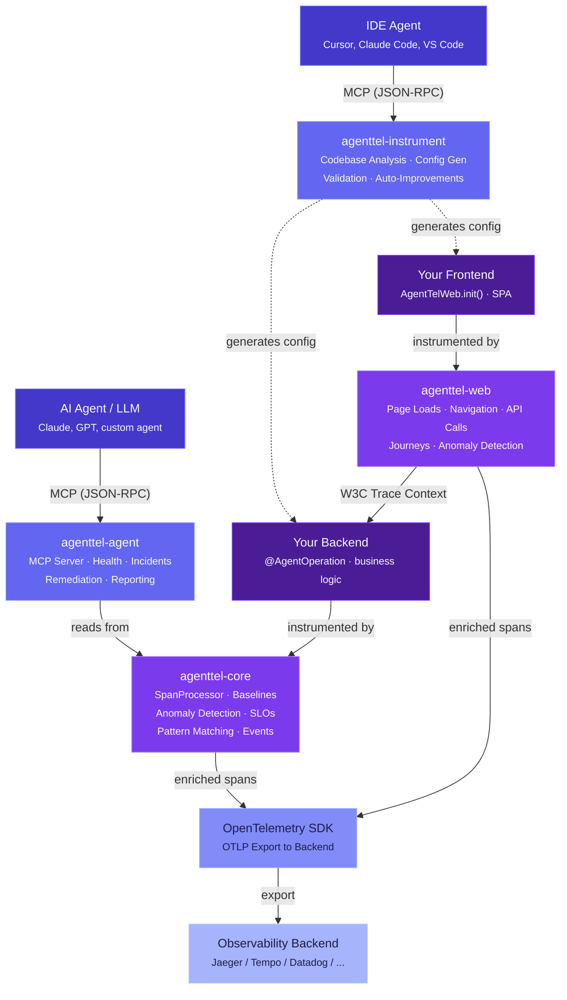
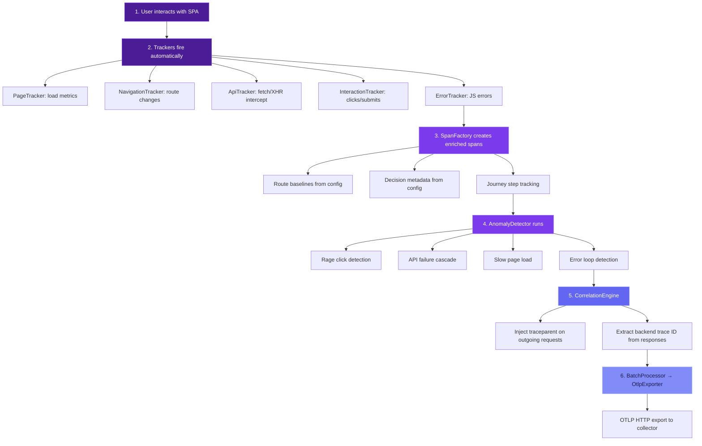
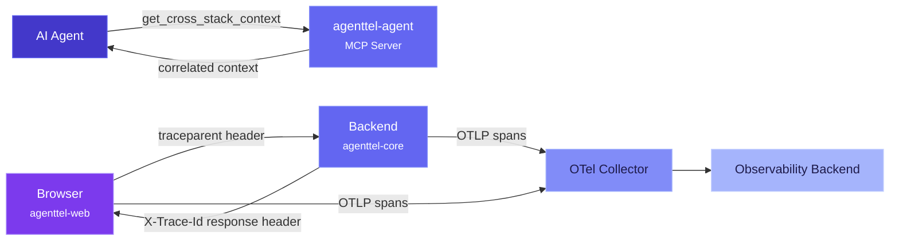

# Architecture

This document describes the technical architecture of AgentTel, including module design, data flow, key components, and extension points.

---

## High-Level Architecture



---

## Module Architecture

### agenttel-api

**Zero-dependency module** containing the public API surface.

| Component | Description |
|-----------|-------------|
| `@AgentOperation` | Method-level annotation declaring operational semantics |
| `@AgentObservable` | Service-level annotation for topology metadata |
| `@DeclareDependency` | Annotation for declaring service dependencies |
| `@DeclareConsumer` | Annotation for declaring downstream consumers |
| `AgentTelAttributes` | String constants for all `agenttel.*` attribute keys |
| Enums | `ServiceTier`, `DependencyType`, `DependencyCriticality`, `EscalationLevel`, etc. |
| Descriptors | `DependencyDescriptor`, `ConsumerDescriptor` records |

**Design decision:** The API module has zero runtime dependencies. It can be added to any project without pulling in OpenTelemetry, Spring, or any other framework.

### agenttel-core

**Runtime engine** that enriches spans and maintains operational state.

```
agenttel-core/
├── baseline/
│   ├── BaselineProvider (interface)
│   ├── StaticBaselineProvider        # From @AgentOperation annotations
│   ├── RollingBaselineProvider       # Lock-free ring buffer sliding window
│   └── CompositeBaselineProvider     # Chains providers with fallback
├── anomaly/
│   ├── AnomalyDetector              # Z-score based anomaly detection
│   ├── PatternMatcher               # Incident pattern recognition
│   └── IncidentPattern (enum)       # CASCADE_FAILURE, MEMORY_LEAK, etc.
├── slo/
│   ├── SloDefinition                # SLO target configuration
│   └── SloTracker                   # Error budget tracking with alerts
├── topology/
│   ├── TopologyRegistry             # Service dependency graph
│   └── AnnotationTopologyScanner    # Reads topology from annotations
├── enrichment/
│   └── AgentTelSpanProcessor        # Main SpanProcessor — enriches every span
├── engine/
│   └── AgentTelEngine               # Orchestrator — wires all components
├── events/
│   ├── AgentTelEventEmitter         # Structured events via OTel Logs API
│   └── DeploymentEventEmitter       # Deployment tracking events
└── resource/
    └── AgentTelResourceProvider      # Resource attributes for topology
```

#### AgentTelSpanProcessor

The central component. Implements `SpanProcessor` with two phases:

**`onStart(Context, ReadWriteSpan)`** — Mutable enrichment phase:
- Resolves `@AgentOperation` metadata for the current span
- Sets topology attributes (`team`, `tier`, `domain`)
- Sets baseline attributes from `CompositeBaselineProvider`
- Sets decision attributes (`retryable`, `idempotent`, `runbook_url`, etc.)

**`onEnd(ReadableSpan)`** — Read-only analysis phase:
- Feeds observed latency into `RollingBaselineProvider`
- Runs `AnomalyDetector` to compute z-score deviation
- Runs `PatternMatcher` to identify incident patterns
- Records success/failure in `SloTracker`
- Emits `agenttel.anomaly.detected` events via `AgentTelEventEmitter`
- Emits `agenttel.slo.budget_alert` events when thresholds are crossed

> **Note:** Because `ReadableSpan` is immutable in `onEnd()`, anomaly attributes are emitted as structured events rather than span attributes. The `CostEnrichingSpanExporter` demonstrates the delegation pattern for cases where span data must be modified at export time.

#### RollingWindow

Lock-free ring buffer for per-operation latency tracking:

```java
RollingWindow window = new RollingWindow(1000); // 1000-sample window
window.record(45.0);    // Record a latency observation
window.recordError();   // Record an error

RollingWindow.Snapshot snapshot = window.snapshot();
// snapshot.p50(), snapshot.p99(), snapshot.mean(), snapshot.stddev(), snapshot.errorRate()
```

- Thread-safe via `AtomicLong` for counters and `synchronized` blocks for array access
- O(1) recording, O(n log n) snapshot computation (sort for percentiles)
- Configurable minimum samples before baseline is considered valid

#### CompositeBaselineProvider

Chains multiple baseline sources with fallback:


The first provider that returns a non-empty baseline for an operation wins. This ensures:
- Explicitly annotated operations use their declared baselines
- Operations without annotations get rolling baselines from observed traffic
- New operations with insufficient data get safe defaults

### agenttel-genai

**GenAI instrumentation module** with optional compile-time dependencies.

```
agenttel-genai/
├── conventions/
│   ├── GenAiAttributes              # gen_ai.* attribute constants
│   ├── AgentTelGenAiAttributes      # agenttel.genai.* constants
│   └── GenAiOperationName           # CHAT, EMBEDDINGS, etc.
├── cost/
│   ├── ModelCostCalculator          # Per-model cost computation
│   └── ModelPricing                 # Pricing data for known models
├── trace/
│   └── GenAiSpanBuilder             # Shared span creation utility
├── springai/
│   ├── SpringAiSpanEnricher         # SpanProcessor enriching Spring AI spans
│   └── CostEnrichingSpanExporter    # SpanExporter adding cost_usd
├── langchain4j/
│   ├── TracingChatLanguageModel     # Decorator for ChatLanguageModel
│   ├── TracingStreamingChatLanguageModel
│   ├── TracingEmbeddingModel
│   ├── TracingContentRetriever      # RAG retrieval instrumentation
│   └── LangChain4jInstrumentation   # Static factory for wrapping models
├── anthropic/
│   └── TracingAnthropicClient       # Anthropic SDK wrapper
├── openai/
│   └── TracingOpenAIClient          # OpenAI SDK wrapper
└── bedrock/
    └── TracingBedrockRuntimeClient  # AWS Bedrock SDK wrapper
```

**Key design decisions:**

1. **Spring AI: Enrich, don't replace.** Spring AI already emits `gen_ai.*` spans via Micrometer. AgentTel adds `agenttel.genai.framework` and `agenttel.genai.cost_usd` to existing spans rather than creating new ones.

2. **LangChain4j: Full instrumentation.** LangChain4j has no built-in OTel tracing, so AgentTel provides complete instrumentation via the decorator pattern.

3. **Provider SDKs: Client wrappers.** Direct instrumentation for Anthropic, OpenAI, and AWS Bedrock Java SDKs via client wrapper classes.

4. **Cost calculation at export time.** Since token counts are only available after model response, cost is computed in a `SpanExporter` wrapper using a delegating `SpanData` pattern.

### agenttel-agent

**Agent interface layer** — everything an AI agent needs to interact with the system.

```
agenttel-agent/
├── health/
│   └── ServiceHealthAggregator      # Real-time health from span data
├── incident/
│   ├── IncidentContext               # Structured incident package
│   └── IncidentContextBuilder        # Builds context from live state
├── remediation/
│   ├── RemediationAction             # Action definition with approval flag
│   ├── RemediationRegistry           # Registry of available actions
│   └── RemediationExecutor           # Executes actions with tracking
├── action/
│   └── AgentActionTracker            # Records agent decisions as OTel spans
├── context/
│   ├── ContextFormatter              # Prompt-optimized output formatters
│   └── AgentContextProvider          # Single entry point for agent queries
├── reporting/
│   ├── TrendAnalyzer                 # Operation metric trends over rolling window
│   ├── SloReportGenerator            # SLO compliance reports (text + JSON)
│   ├── ExecutiveSummaryBuilder       # ~300 token LLM-optimized service overview
│   └── CrossStackContextBuilder      # Correlated frontend-backend context
└── mcp/
    ├── McpServer                     # JSON-RPC HTTP server
    ├── McpToolDefinition             # Tool schema definition
    ├── McpToolHandler                # Tool execution interface
    └── AgentTelMcpServerBuilder      # Builder with 9 pre-registered tools
```

**MCP Tools** (9 total):

| Tool | Description |
|------|-------------|
| `get_service_health` | Operation metrics, dependency status, SLO budget |
| `get_incident_context` | Structured incident package: what's happening, what changed, what's affected, what to do |
| `list_remediation_actions` | Available remediation actions for an operation |
| `execute_remediation` | Execute a remediation action with approval workflow |
| `get_recent_agent_actions` | Audit trail of recent agent decisions |
| `get_slo_report` | SLO compliance report across all tracked operations |
| `get_executive_summary` | High-level service status summary (~300 tokens) |
| `get_trend_analysis` | Latency, error rate, and throughput trends for an operation |
| `get_cross_stack_context` | Correlated frontend-backend context for an operation |

See [Agent Layer](04-AGENT-LAYER.md) for detailed documentation.

### agenttel-web

**Browser telemetry SDK** (TypeScript) — agent-ready frontend observability.

```
agenttel-web/
├── core/
│   ├── AgentTelWeb                   # Singleton entry point — init(), getInstance()
│   ├── SpanFactory                   # Creates OTel-compatible spans with enrichment
│   ├── AttributeKeys                 # agenttel.client.* attribute constants
│   └── Resource                      # Frontend resource attributes
├── trackers/
│   ├── PageTracker                   # Page load metrics via Navigation Timing API
│   ├── NavigationTracker             # SPA route change tracking
│   ├── ApiTracker                    # fetch/XMLHttpRequest interception
│   ├── InteractionTracker            # Click/submit event tracking
│   └── ErrorTracker                  # JavaScript error + error loop detection
├── enrichment/
│   ├── AnomalyDetector               # Rage clicks, API cascades, slow loads, error loops
│   ├── JourneyTracker                # Multi-step funnel tracking with abandonment
│   ├── RouteMatcher                  # Parameterized route matching (/checkout/:step)
│   └── CorrelationEngine             # W3C Trace Context injection + backend trace extraction
├── transport/
│   ├── OtlpExporter                  # OTLP HTTP exporter for browser
│   └── BatchProcessor                # Batched span export with configurable flush
├── config/
│   ├── Types                         # AgentTelWebConfig interface
│   └── Defaults                      # Default configuration values
└── types/
    ├── Span, Journey, Anomaly, Baseline
```

**Key design decisions:**

1. **Auto-instrumentation by default.** Page loads, navigation, API calls, clicks, and errors are captured automatically — no manual code changes needed.

2. **Route-aware enrichment.** Each route can have its own baselines (page load P50/P99, API call P50) and decision metadata (escalation level, runbook URL, business criticality).

3. **Cross-stack correlation.** W3C Trace Context (`traceparent`) is injected on all outgoing `fetch`/`XMLHttpRequest` calls, and backend trace IDs are extracted from response headers — enabling full browser-to-database trace linking.

4. **PII safety.** Interaction targets use `data-agenttel-target` attributes rather than CSS selectors or text content, avoiding accidental PII capture.

### agenttel-instrument

**IDE MCP server** (Python) — AI-assisted instrumentation automation.

```
agenttel-instrument/
├── mcp/
│   ├── Server                        # JSON-RPC 2.0 HTTP server (aiohttp)
│   └── Models                        # MCP request/response types
├── tools/
│   ├── AnalyzeCodebase               # Java/Spring Boot source scanner
│   ├── InstrumentBackend             # Backend config generator
│   ├── InstrumentFrontend            # Frontend config generator (React route detection)
│   ├── Validate                      # Config validation against source code
│   ├── Suggest                       # Improvement detection engine
│   ├── ApplyImprovements             # Batch auto-apply with live health data
│   └── ApplySingle                   # Single improvement application
├── feedback/
│   ├── Engine                        # Detects missing baselines, stale configs, gaps
│   ├── Applier                       # Safe config file modification
│   └── Models                        # FeedbackEvent, FeedbackType, RiskLevel
└── config/
    ├── Config                        # Server + backend MCP connection settings
    └── Types                         # Configuration data classes
```

**Key design decisions:**

1. **MCP-native.** Designed as an MCP server so any MCP-compatible AI assistant (Cursor, Claude Code, VS Code Copilot) can use it directly.

2. **Read-then-propose.** Tools like `instrument_backend` and `instrument_frontend` return proposed changes without modifying files — the IDE agent decides what to apply.

3. **Risk-based auto-apply.** `apply_improvements` only auto-applies low-risk changes (e.g., baseline calibration from observed data). Medium and high-risk changes are flagged for human review.

4. **Live health integration.** Connects to the backend MCP server to fetch real health/SLO data for baseline calibration, rather than using arbitrary defaults.

### agenttel-spring-boot-starter

**Auto-configuration** that wires everything together for Spring Boot applications.

| Component | Description |
|-----------|-------------|
| `AgentTelAutoConfiguration` | Creates and configures `AgentTelEngine`, all providers, and SLO tracker |
| `AgentTelProperties` | Type-safe configuration binding for `agenttel.*` properties |
| `AgentTelAnnotationBeanPostProcessor` | Scans beans for `@AgentOperation` and registers metadata |
| `AgentTelHealthIndicator` | Spring Boot Actuator health endpoint integration |

---

## Data Flow

### Span Enrichment Flow


### Agent Query Flow


### Frontend Telemetry Flow



### Cross-Stack Correlation Flow



---

## Extension Points

| Extension Point | Interface | Description |
|----------------|-----------|-------------|
| Baseline Provider | `BaselineProvider` | Custom baseline sources (ML models, external systems) |
| MCP Tools | `McpToolHandler` | Register custom tools on the MCP server |
| Remediation Actions | `RemediationAction` | Register domain-specific remediation actions |
| Span Processing | `SpanProcessor` | Additional span enrichment via standard OTel API |
| Event Handling | `AgentTelEventEmitter` | Custom structured event emission |

### Adding a Custom Baseline Provider

```java
public class MlBaselineProvider implements BaselineProvider {
    @Override
    public Optional<OperationBaseline> getBaseline(String operationName) {
        // Query your ML model for predicted baselines
        return Optional.of(new OperationBaseline(predictedP50, predictedP99, predictedErrorRate));
    }
}

// Wire into composite chain
CompositeBaselineProvider composite = new CompositeBaselineProvider(
    staticProvider, mlProvider, rollingProvider
);
```

### Adding a Custom MCP Tool

```java
McpServer server = new AgentTelMcpServerBuilder()
    .contextProvider(contextProvider)
    .build();

server.registerTool(
    new McpToolDefinition("query_logs", "Search recent logs",
        Map.of("query", new ParameterDefinition("string", "Log search query")),
        List.of("query")),
    args -> logService.search(args.get("query"))
);
```

---

## Performance Characteristics

| Operation | Complexity | Notes |
|-----------|-----------|-------|
| Span enrichment (onStart) | O(1) | HashMap lookups for annotations and baselines |
| Latency recording | O(1) | Ring buffer write |
| Baseline snapshot | O(n log n) | Sort for percentiles (n = window size) |
| Anomaly detection | O(1) | Z-score computation from pre-computed stats |
| Pattern matching | O(k) | k = number of tracked dependencies |
| SLO tracking | O(m) | m = number of registered SLOs |
| Health aggregation | O(1) per span | ConcurrentHashMap + AtomicLong |

**Memory footprint per operation:**
- Rolling window: ~8KB per operation (1000 doubles)
- Latency trend: ~800B per operation (50 doubles + 50 booleans)
- Health aggregation: ~16KB per operation (1000 recent latencies)

All data structures are bounded with configurable limits to prevent unbounded growth.

---

## Thread Safety

All components are designed for concurrent access:

- `TopologyRegistry`: `ConcurrentHashMap` + `volatile` fields. Written at startup, read concurrently.
- `RollingWindow`: `AtomicLong` counters + `synchronized` array access.
- `ServiceHealthAggregator`: `ConcurrentHashMap` with `AtomicLong` counters per operation.
- `SloTracker`: `ConcurrentHashMap` with `AtomicLong` counters per SLO.
- `AgentActionTracker`: `ConcurrentLinkedDeque` for bounded history.
- Bounded collections use `Collections.synchronizedList` with periodic pruning.

---

## Security Considerations

- **No secrets in telemetry.** AgentTel does not capture request/response bodies, headers, or any PII. Only operational metadata is recorded.
- **MCP server authentication.** The built-in MCP server does not include authentication. In production, deploy behind a reverse proxy or API gateway with appropriate auth.
- **Remediation approval workflow.** Actions marked `requiresApproval = true` cannot be executed without explicit approval, preventing unauthorized automated changes.
- **Action audit trail.** All agent actions are recorded as OTel spans, providing a complete audit log of what any agent did and why.
