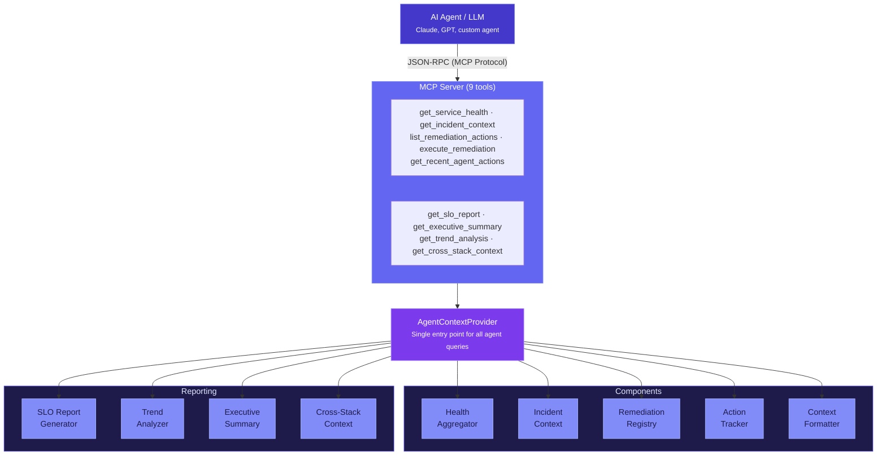

# Agent Layer

The `agenttel-agent` module provides the interface layer between AI agents and your application's telemetry. It packages real-time system state into structured formats that LLMs can consume, and provides tools for agents to query health, diagnose incidents, and execute remediation.

---

## Overview



---

## MCP Server

The MCP (Model Context Protocol) server exposes telemetry as tools that AI agents can invoke over HTTP using the JSON-RPC 2.0 protocol.

### Starting the Server

```java
McpServer mcp = new AgentTelMcpServerBuilder()
    .port(8081)
    .contextProvider(agentContextProvider)
    .remediationExecutor(remediationExecutor)
    .build();

mcp.start();
```

### Endpoints

| Endpoint | Method | Description |
|----------|--------|-------------|
| `POST /mcp` | JSON-RPC 2.0 | MCP tool listing and invocation |
| `GET /health` | HTTP | Server health check |

### JSON-RPC Methods

| Method | Description |
|--------|-------------|
| `initialize` | MCP handshake — returns protocol version and capabilities |
| `tools/list` | List all available tools with their schemas |
| `tools/call` | Invoke a specific tool with arguments |

### Built-in Tools

#### get_service_health

Returns current service health including operation metrics, dependency status, and SLO budget.

**Parameters:**

| Name | Type | Required | Description |
|------|------|----------|-------------|
| `format` | string | No | `"text"` (default) or `"json"` |

**Example text output:**

```
SERVICE: payment-service | STATUS: DEGRADED | 2025-01-15T14:30:00Z
OPERATIONS:
  POST /api/payments: err=5.2% p50=312ms p99=1200ms [ELEVATED]
  GET /api/prices: err=0.1% p50=12ms p99=45ms
DEPENDENCIES:
  postgres: err=0.0% avg=8ms
  stripe-api: err=12.3% avg=2100ms
SLOs:
  payment-availability: budget=22.0% burn=0.8x
```

#### get_incident_context

Returns a complete incident diagnosis for a specific operation — what's happening, what changed, what's affected, and what to do.

**Parameters:**

| Name | Type | Required | Description |
|------|------|----------|-------------|
| `operation_name` | string | Yes | The operation to diagnose |

**Example output:**

```
=== INCIDENT inc-a3f2b1c4 ===
SEVERITY: HIGH
TIME: 2025-01-15T14:30:00Z
SUMMARY: POST /api/payments experiencing elevated error rate (5.2%)

## WHAT IS HAPPENING
Operation: POST /api/payments
Error Rate: 5.2% (baseline: 0.1%)
Latency P50: 312ms (baseline: 45ms)
Anomaly Score: 0.85
Service Health: DEGRADED
Patterns: ERROR_RATE_SPIKE

## WHAT CHANGED
Last Deploy: v2.1.0 at 2025-01-15T14:00:00Z
  [deployment] Deployed version v2.1.0 (2025-01-15T14:00:00Z)
  [config_change] Updated rate limit to 500 rps (2025-01-15T13:45:00Z)

## WHAT IS AFFECTED
Scope: operation_specific
User-Facing: YES
Affected Ops: POST /api/payments
Affected Deps: stripe-api
Affected Consumers: checkout-service

## SUGGESTED ACTIONS
Escalation: page_oncall
  - [HIGH] rollback_deployment: Rollback to previous version (NEEDS APPROVAL)
  - [MEDIUM] enable_circuit_breakers: Circuit break stripe-api

## SIMILAR PAST INCIDENTS
  inc-2024-dec-03: stripe-api timeout → Increased timeout to 10s
```

#### list_remediation_actions

Lists available remediation actions for a specific operation.

**Parameters:**

| Name | Type | Required | Description |
|------|------|----------|-------------|
| `operation_name` | string | Yes | Operation to get actions for |

#### execute_remediation

Executes a remediation action. Actions requiring approval need the `approved_by` field.

**Parameters:**

| Name | Type | Required | Description |
|------|------|----------|-------------|
| `action_name` | string | Yes | Name of the action to execute |
| `reason` | string | Yes | Reason for executing this action |
| `approved_by` | string | No | Required for actions needing approval |

#### get_recent_agent_actions

Returns the audit trail of recent agent decisions and actions.

#### get_slo_report

Returns SLO compliance report across all tracked operations — budget remaining, burn rate, and compliance status.

**Parameters:**

| Name | Type | Required | Description |
|------|------|----------|-------------|
| `format` | string | No | `"text"` (default) or `"json"` |

**Example text output:**

```
=== SLO REPORT ===
Generated: 2025-01-15T14:30:00Z
Total SLOs: 2

SUMMARY: 1 healthy, 1 at risk, 0 violated

  [HEALTHY] payment-availability
    Target: 99.90%  Actual: 99.95%  Budget: 50.0%  Burn: 0.5x  Requests: 10000  Failed: 5
  [AT_RISK] payment-latency-p99
    Target: 200ms  Actual: 312ms  Budget: 22.0%  Burn: 0.8x  Requests: 10000  Failed: 520
```

#### get_executive_summary

Returns a high-level executive summary of service health (~300 tokens), optimized for LLM context windows.

**Parameters:** None.

**Example output:**

```
=== EXECUTIVE SUMMARY ===
Service: payment-service | Status: DEGRADED | 2025-01-15T14:30:00Z

STATUS: 1 operation degraded. POST /api/payments error rate elevated (5.2%).

TOP ISSUES:
  1. POST /api/payments: err=5.2% (baseline 0.1%), p50=312ms (baseline 45ms)

SLO BUDGET: 1/2 healthy, 1 at risk (payment-latency-p99: 22% remaining)

OPERATIONS: 2 tracked, 10,000 total requests
```

#### get_trend_analysis

Returns latency, error rate, and throughput trends for an operation over a time window with direction indicators.

**Parameters:**

| Name | Type | Required | Description |
|------|------|----------|-------------|
| `operation_name` | string | Yes | Operation name to analyze trends for |
| `window_minutes` | string | No | Time window in minutes (default: `"30"`) |

**Example output:**

```
=== TREND ANALYSIS: POST /api/payments ===
Window: 30 minutes | Samples: 12

LATENCY P50: 45ms → 312ms  ↑ RISING (+593%)
LATENCY P99: 200ms → 1200ms  ↑ RISING (+500%)
ERROR RATE: 0.1% → 5.2%  ↑ RISING (+5100%)
THROUGHPUT: 180 rpm → 165 rpm  ↓ FALLING (-8%)

ASSESSMENT: Operation is degrading. Latency and error rate are both rising sharply.
```

#### get_cross_stack_context

Returns correlated frontend and backend context for an operation — traces the full user-to-database path when `agenttel-web` is connected.

**Parameters:**

| Name | Type | Required | Description |
|------|------|----------|-------------|
| `operation_name` | string | Yes | Backend operation name to get cross-stack context for |

**Example output (with frontend connected):**

```
=== CROSS-STACK CONTEXT: POST /api/payments ===

## FRONTEND (User Experience)
  Route: /checkout/payment
  Page Load P50: 850ms (baseline: 800ms)
  API Call P50: 520ms (baseline: 300ms)
  Journey: checkout (step 4/5)
  Funnel Health: 62% completion (baseline: 65%)
  Anomalies: slow_page_load
  Affected Users: ~120 in last 15 min

## BACKEND (payment-service)
  Operation: POST /api/payments
  Error Rate: 5.2% (baseline: 0.1%)
  Latency P50: 312ms (baseline: 45ms)
  Deviation: ELEVATED

## SLO STATUS
  payment-availability: 99.95% (target: 99.9%) budget=50.0%
  payment-latency-p99: 312ms (target: 200ms) budget=22.0%

## CORRELATION
  Frontend → Backend trace linking: active
  Browser trace IDs correlated with backend spans via W3C Trace Context
```

**Example output (without frontend):**

```
## FRONTEND (User Experience)
  Status: No frontend telemetry connected
  Note: Connect agenttel-web SDK to enable cross-stack correlation.
```

### Registering Custom Tools

```java
McpServer server = builder.build();

server.registerTool(
    new McpToolDefinition(
        "search_logs",
        "Search recent application logs for a pattern",
        Map.of("query", new ParameterDefinition("string", "Search query"),
               "timeframe", new ParameterDefinition("string", "Time range (e.g., '1h', '30m')")),
        List.of("query")
    ),
    args -> logService.search(args.get("query"), args.get("timeframe"))
);
```

---

## Service Health Aggregation

`ServiceHealthAggregator` maintains real-time health metrics computed from span data.

### Recording Metrics

```java
ServiceHealthAggregator health = new ServiceHealthAggregator(rollingBaselines, sloTracker);

// Called from SpanProcessor or interceptor
health.recordSpan("POST /api/payments", 312.0, false);
health.recordDependencyCall("stripe-api", 2100.0, true);
```

### Querying Health

```java
// Full service summary
ServiceHealthSummary summary = health.getHealthSummary("payment-service");
// summary.status()       → DEGRADED
// summary.operations()   → List<OperationSummary>
// summary.dependencies() → List<DependencySummary>

// Single operation
Optional<OperationSummary> op = health.getOperationHealth("POST /api/payments");
// op.errorRate()      → 0.052
// op.latencyP50Ms()   → 312.0
// op.deviationStatus() → "elevated"
```

### Health Status Determination

| Condition | Status |
|-----------|--------|
| Any SLO with < 10% budget remaining | `CRITICAL` |
| Any operation with > 10% error rate (100+ requests) | `CRITICAL` |
| Any operation with > 1% error rate (100+ requests) | `DEGRADED` |
| Any dependency with > 50% error rate (10+ calls) | `DEGRADED` |
| Any SLO with < 50% budget remaining | `DEGRADED` |
| None of the above | `HEALTHY` |

---

## Incident Context Builder

`IncidentContextBuilder` assembles a complete incident package from current system state.

### Structure

Every `IncidentContext` contains four sections designed for LLM reasoning:

| Section | Record | Contents |
|---------|--------|----------|
| What Is Happening | `WhatIsHappening` | Operation name, current vs baseline metrics, detected patterns, anomaly score |
| What Changed | `WhatChanged` | Recent deployments, config changes, with timestamps |
| What Is Affected | `WhatIsAffected` | Affected operations, dependencies, consumers, impact scope, user-facing flag |
| What To Do | `WhatToDo` | Runbook URL, escalation level, suggested actions with confidence and approval requirements |

Plus: severity (LOW/MEDIUM/HIGH/CRITICAL) and similar past incidents.

### Severity Determination

| Condition | Severity |
|-----------|----------|
| Service health is CRITICAL | `CRITICAL` |
| Cascade failure pattern detected | `CRITICAL` |
| Error rate > 10% | `HIGH` |
| Service health is DEGRADED | `MEDIUM` |
| Default | `LOW` |

### Change Tracking

```java
IncidentContextBuilder builder = new IncidentContextBuilder(
    healthAggregator, topology, rollingBaselines, remediationRegistry);

// Record changes for correlation
builder.recordDeployment("v2.1.0", "2025-01-15T14:00:00Z");
builder.recordConfigChange("Updated rate limit to 500 rps");

// Record historical incidents for pattern matching
builder.recordHistoricalIncident("inc-2024-dec-03", "2024-12-03T10:00:00Z",
    "Increased timeout to 10s", "stripe-api timeout");
```

---

## Remediation Framework

### Defining Actions

```java
RemediationAction rollback = RemediationAction.builder("rollback_deployment", "POST /api/payments")
    .description("Rollback to previous known-good version")
    .type(RemediationAction.ActionType.ROLLBACK)
    .requiresApproval(true)
    .command("kubectl rollout undo deployment/payment-service")
    .build();

RemediationAction circuitBreak = RemediationAction.builder("circuit_break_stripe", "POST /api/payments")
    .description("Enable circuit breaker on stripe-api dependency")
    .type(RemediationAction.ActionType.CIRCUIT_BREAKER)
    .requiresApproval(false)
    .build();
```

### Registering Actions

```java
RemediationRegistry registry = new RemediationRegistry();

// Operation-specific actions
registry.register(rollback);
registry.register(circuitBreak);

// Global actions (apply to all operations)
registry.registerGlobal(RemediationAction.builder("enable_debug_logging", "*")
    .description("Enable DEBUG logging for 5 minutes")
    .type(RemediationAction.ActionType.CUSTOM)
    .requiresApproval(false)
    .build());
```

### Executing Actions

```java
RemediationExecutor executor = new RemediationExecutor(registry, actionTracker);

// Auto-approved action
RemediationResult result = executor.execute("circuit_break_stripe", "stripe-api error rate at 12%");

// Action requiring approval
RemediationResult result = executor.executeApproved(
    "rollback_deployment",
    "Error rate spike after v2.1.0 deployment",
    "oncall-engineer@company.com"
);
```

### Action Types

| Type | Description |
|------|-------------|
| `RESTART` | Rolling restart of service instances |
| `SCALE` | Horizontal or vertical scaling |
| `ROLLBACK` | Deployment rollback |
| `CIRCUIT_BREAKER` | Enable/modify circuit breaker |
| `RATE_LIMIT` | Adjust rate limiting |
| `CACHE_FLUSH` | Flush application caches |
| `CUSTOM` | Domain-specific action |

---

## Agent Action Tracking

Every decision and action taken by an AI agent is recorded as an OpenTelemetry span for full auditability.

### Recording Actions

```java
AgentActionTracker tracker = new AgentActionTracker(openTelemetry);

// Simple action record
tracker.recordAction("scale_up", "High latency detected",
    Map.of("instances", "3", "reason", "p50 > 2x baseline"));

// Decision with rationale
tracker.recordDecision(
    "response_strategy",
    "Error rate rising but not critical — prefer conservative approach",
    "increase_timeout",
    List.of("increase_timeout", "add_retry", "circuit_break", "rollback")
);

// Traced action (captures success/failure)
String result = tracker.traceAction("compute_recommendation", "Need action plan", () -> {
    // Complex computation...
    return "scale_up";
});
```

### Span Attributes

Each tracked action creates a span with:

| Attribute | Description |
|-----------|-------------|
| `agenttel.agent.action.name` | Action identifier |
| `agenttel.agent.action.reason` | Why the action was taken |
| `agenttel.agent.action.status` | `"completed"`, `"success"`, or `"failed"` |
| `agenttel.agent.action.type` | `"action"`, `"decision"`, or `"traced_action"` |
| `agenttel.agent.decision.rationale` | Reasoning (for decisions) |
| `agenttel.agent.decision.chosen` | Selected option (for decisions) |
| `agenttel.agent.decision.options` | All options considered (for decisions) |

---

## Context Formatters

`ContextFormatter` produces prompt-optimized output in multiple formats, each designed for a specific context window budget.

### Compact Health (~200 tokens)

Use as a system prompt prefix or quick status check.

```java
String compact = ContextFormatter.formatHealthCompact(healthSummary);
```

### Full Incident (~800 tokens)

Use when an agent needs to diagnose and act on an incident.

```java
String full = ContextFormatter.formatIncidentFull(incidentContext);
```

### Compact Incident (~100 tokens)

Use for notifications or alert summaries.

```java
String brief = ContextFormatter.formatIncidentCompact(incidentContext);
```

### JSON Health

Use for structured tool results that agents can parse.

```java
String json = ContextFormatter.formatHealthAsJson(healthSummary);
```

---

## AgentContextProvider

The single entry point for all agent queries. Wires together all components, including the reporting layer.

```java
AgentContextProvider provider = new AgentContextProvider(
    healthAggregator,
    incidentContextBuilder,
    remediationRegistry,
    topology,
    patternMatcher,
    rollingBaselines,
    actionTracker
);

// Wire in reporting components
provider.setReportingComponents(
    sloReportGenerator,
    trendAnalyzer,
    executiveSummaryBuilder,
    crossStackContextBuilder
);

// Core queries
String health = provider.getHealthSummary();
String incident = provider.getIncidentContext("POST /api/payments");
String actions = provider.getAvailableActions("POST /api/payments");
String audit = provider.getRecentActions();

// Reporting queries
String sloReport = provider.getSloReport();
String trends = provider.getTrendAnalysis("POST /api/payments", 30);
String executive = provider.getExecutiveSummary();
String crossStack = provider.getCrossStackContext("POST /api/payments");

// JSON for structured tool results
String healthJson = provider.getHealthSummaryJson();

// Raw objects for programmatic access
IncidentContext ctx = provider.getIncidentContextObject("POST /api/payments");
```

---

## Integration with Spring Boot

The agent layer can be integrated with Spring Boot auto-configuration:

```java
@Configuration
public class AgentConfig {

    @Bean
    public ServiceHealthAggregator serviceHealthAggregator(
            RollingBaselineProvider baselines, SloTracker sloTracker) {
        return new ServiceHealthAggregator(baselines, sloTracker);
    }

    @Bean
    public AgentActionTracker agentActionTracker(OpenTelemetry otel) {
        return new AgentActionTracker(otel);
    }

    @Bean
    public RemediationRegistry remediationRegistry() {
        RemediationRegistry registry = new RemediationRegistry();
        // Register your actions...
        return registry;
    }

    @Bean
    public McpServer mcpServer(AgentContextProvider provider,
                                RemediationExecutor executor) throws IOException {
        McpServer server = new AgentTelMcpServerBuilder()
            .port(8081)
            .contextProvider(provider)
            .remediationExecutor(executor)
            .build();
        server.start();
        return server;
    }
}
```
