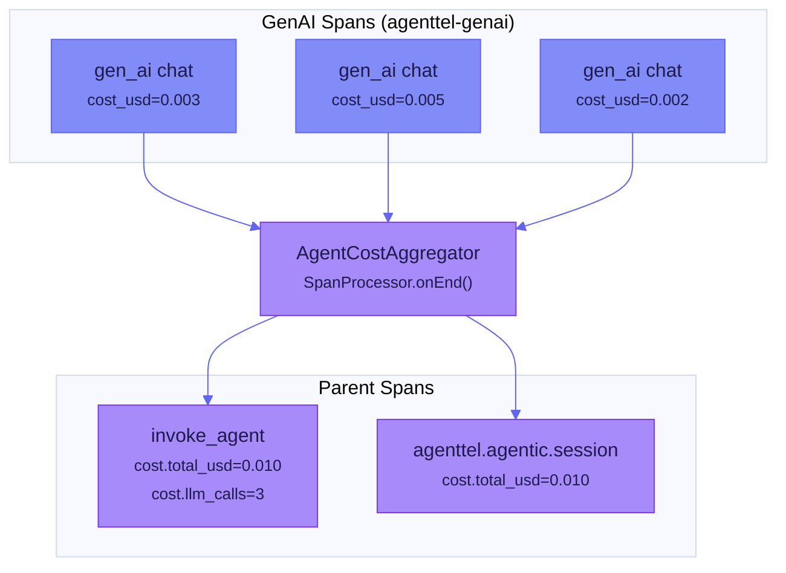

# Agent Cost Tracking

`AgentCostAggregator` is an OTel `SpanProcessor` that automatically rolls up LLM costs from GenAI spans into parent agent invocation and session spans — giving you per-invocation and per-orchestration cost visibility.

## How It Works



1. When a GenAI span ends with `agenttel.genai.cost_usd > 0`, the aggregator accumulates its cost and token counts by trace ID
2. When an `invoke_agent` or `agenttel.agentic.session` span ends, the aggregator applies accumulated totals as attributes

---

## Cost Attributes

| Attribute | Type | Description |
|-----------|------|-------------|
| `agenttel.agentic.cost.total_usd` | Double | Total LLM cost in USD |
| `agenttel.agentic.cost.input_tokens` | Long | Total input tokens consumed |
| `agenttel.agentic.cost.output_tokens` | Long | Total output tokens generated |
| `agenttel.agentic.cost.llm_calls` | Long | Number of LLM API calls |
| `agenttel.agentic.cost.reasoning_tokens` | Long | Reasoning/thinking tokens (e.g., Claude extended thinking) |
| `agenttel.agentic.cost.cached_read_tokens` | Long | Tokens served from cache reads |
| `agenttel.agentic.cost.cached_write_tokens` | Long | Tokens written to cache |

---

## Spring Boot Setup

When both `agenttel-agentic` and `agenttel-genai` are on the classpath, cost tracking is **automatic**. `AgentTelAgenticAutoConfiguration` creates the `AgentCostAggregator` bean and registers it as an OTel SpanProcessor.

=== "Maven"

    ```xml
    <dependencies>
        <dependency>
            <groupId>dev.agenttel</groupId>
            <artifactId>agenttel-spring-boot-starter</artifactId>
            <version>0.1.0-alpha</version>
        </dependency>
        <dependency>
            <groupId>dev.agenttel</groupId>
            <artifactId>agenttel-agentic</artifactId>
            <version>0.1.0-alpha</version>
        </dependency>
        <dependency>
            <groupId>dev.agenttel</groupId>
            <artifactId>agenttel-genai</artifactId>
            <version>0.1.0-alpha</version>
        </dependency>
    </dependencies>
    ```

=== "Gradle (Kotlin)"

    ```kotlin
    dependencies {
        implementation("dev.agenttel:agenttel-spring-boot-starter:0.1.0-alpha")
        implementation("dev.agenttel:agenttel-agentic:0.1.0-alpha")
        implementation("dev.agenttel:agenttel-genai:0.1.0-alpha")
    }
    ```

No additional configuration is needed. The auto-configuration registers the cost aggregator via `AutoConfigurationCustomizerProvider`:

```java
// This happens automatically — shown for reference
customizer.addTracerProviderCustomizer(
    (builder, config) -> builder.addSpanProcessor(costAggregator));
```

---

## Programmatic Registration

For non-Spring applications, register the aggregator manually:

```java
AgentCostAggregator costAggregator = new AgentCostAggregator();

SdkTracerProvider tracerProvider = SdkTracerProvider.builder()
    .addSpanProcessor(costAggregator)
    .addSpanProcessor(BatchSpanProcessor.builder(exporter).build())
    .build();

OpenTelemetry otel = OpenTelemetrySdk.builder()
    .setTracerProvider(tracerProvider)
    .build();
```

!!! warning
    Register `AgentCostAggregator` **before** the `BatchSpanProcessor` (exporter) so that cost attributes are set on parent spans before they are exported.

---

## Monitoring Costs Across Orchestrations

For multi-agent orchestrations, costs aggregate at the session level:

```java
try (SequentialOrchestration seq = tracer.orchestrate(
        OrchestrationPattern.SEQUENTIAL, 3)) {

    try (AgentInvocation s1 = seq.stage("researcher", 1)) {
        // GenAI calls here → costs tracked per-invocation
        chatModel.generate(messages);  // cost_usd = 0.003
        s1.complete(true);
    }

    try (AgentInvocation s2 = seq.stage("writer", 2)) {
        chatModel.generate(messages);  // cost_usd = 0.008
        chatModel.generate(messages);  // cost_usd = 0.005
        s2.complete(true);
    }

    try (AgentInvocation s3 = seq.stage("reviewer", 3)) {
        chatModel.generate(messages);  // cost_usd = 0.004
        s3.complete(true);
    }

    seq.complete();
}
// Session span gets: cost.total_usd = 0.020, cost.llm_calls = 4
```

The aggregator uses `ConcurrentHashMap` with `DoubleAdder` and `LongAdder` for thread-safe accumulation across parallel branches.

---

## Budget Guardrails

Combine cost tracking with guardrail activation to enforce budget limits:

```java
try (AgentInvocation inv = tracer.invoke("Process batch")) {
    inv.maxSteps(100);
    double budgetLimit = 5.00;

    for (var item : items) {
        chatModel.generate(buildPrompt(item));

        // Check accumulated cost (requires custom tracking)
        if (currentCost > budgetLimit) {
            inv.guardrail("budget-limit", GuardrailAction.BLOCK,
                String.format("Cost $%.2f exceeded budget $%.2f", currentCost, budgetLimit));
            inv.complete(InvocationStatus.ESCALATED);
            return;
        }
    }

    inv.complete(true);
}
```

!!! tip
    The `AgentCostAggregator` sets cost attributes when spans **end**. For real-time budget enforcement during an invocation, maintain a local cost counter alongside the aggregator.

---

## Further Reading

- [Agent Observability](agent-observability.md) — core agent tracing APIs
- [Orchestration Patterns](orchestration-patterns.md) — multi-agent patterns with cost tracking
- [GenAI Instrumentation](genai-instrumentation.md) — per-call cost calculation for LLM providers
- [Agentic Attributes Reference](../reference/agent-attributes.md#cost-aggregation) — cost attribute details
