# Agent Observability

Instrument your AI agent's lifecycle — invocations, reasoning steps, tool calls, task decomposition, handoffs, human checkpoints, code execution, evaluation, RAG, memory access, and error classification — with structured OpenTelemetry spans.

## Overview

| Feature | What's Tracked | Key Span |
|---------|---------------|----------|
| Agent Identity | Name, type, framework, version | `invoke_agent` |
| Invocation Lifecycle | Goal, status, step count, max steps | `invoke_agent` |
| Reasoning Steps | Thought, action, observation, evaluation, revision | `agenttel.agentic.step` |
| Tool Calls | Tool name, status (success/error/timeout) | `agenttel.agentic.tool_call` |
| Task Decomposition | Nested tasks with depth and parent tracking | `agenttel.agentic.task` |
| Handoffs | Source agent, target agent, reason, chain depth | `agenttel.agentic.handoff` |
| Human Checkpoints | Approval, feedback, correction, decision + wait time | `agenttel.agentic.human_input` |
| Code Execution | Language, exit code, sandbox status | `agenttel.agentic.code_execution` |
| Evaluation | Scorer name, criteria, score, feedback, eval type | `agenttel.agentic.evaluate` |
| RAG Pipeline | Retriever query, document count, relevance; reranker model | `agenttel.agentic.retriever` / `agenttel.agentic.reranker` |
| Guardrails | Triggered name, action (block/warn/log/escalate), reason | `agenttel.agentic.guardrail` |
| Memory Access | Read, write, delete, search operations | `agenttel.agentic.memory` |
| Error Classification | Source (llm/tool/agent/guardrail/timeout/network), retryable | On `invoke_agent` |

---

## Dependencies

=== "Maven"

    ```xml
    <dependency>
        <groupId>dev.agenttel</groupId>
        <artifactId>agenttel-agentic</artifactId>
        <version>0.2.0-alpha</version>
    </dependency>
    ```

=== "Gradle (Kotlin)"

    ```kotlin
    implementation("dev.agenttel:agenttel-agentic:0.2.0-alpha")
    ```

---

## Quick Start

```java
import io.agenttel.agentic.trace.AgentTracer;
import io.agenttel.agentic.AgentType;
import io.agenttel.agentic.StepType;

// 1. Create a tracer
AgentTracer tracer = AgentTracer.create(openTelemetry)
    .agentName("incident-responder")
    .agentType(AgentType.SINGLE)
    .framework("custom")
    .build();

// 2. Start an invocation
try (AgentInvocation invocation = tracer.invoke("Diagnose high latency")) {
    // 3. Record reasoning steps
    invocation.step(StepType.THOUGHT, "Need to check service health metrics");

    // 4. Make a tool call
    try (ToolCallScope tool = invocation.toolCall("get_service_health")) {
        var health = mcpClient.call("get_service_health", params);
        tool.success();
    }

    // 5. Record another step
    invocation.step(StepType.OBSERVATION, "Latency elevated on POST /api/payments");

    // 6. Complete the invocation
    invocation.complete(true);
}
```

**Span output:**

```
invoke_agent
  agenttel.agentic.agent.name          = "incident-responder"
  agenttel.agentic.agent.type          = "single"
  agenttel.agentic.invocation.goal     = "Diagnose high latency"
  agenttel.agentic.invocation.status   = "success"
  agenttel.agentic.invocation.steps    = 3
  agenttel.agentic.quality.goal_achieved = true
  └── agenttel.agentic.step
      agenttel.agentic.step.number     = 1
      agenttel.agentic.step.type       = "thought"
  └── agenttel.agentic.tool_call
      agenttel.agentic.step.tool_name  = "get_service_health"
      agenttel.agentic.step.tool_status = "success"
  └── agenttel.agentic.step
      agenttel.agentic.step.number     = 3
      agenttel.agentic.step.type       = "observation"
```

---

## Agent Identity

Configure agent identity via the builder, YAML config, or `@AgentMethod` annotation. These attributes appear on every `invoke_agent` span.

### Programmatic (Builder)

```java
AgentTracer tracer = AgentTracer.create(openTelemetry)
    .agentName("code-reviewer")
    .agentType(AgentType.WORKER)
    .framework("langchain4j")
    .agentVersion("2.1.0")
    .build();
```

### YAML Configuration

Define agent identity and guardrails in `application.yml`. YAML config takes priority over annotations and builder defaults.

```yaml
agenttel:
  agentic:
    loop-threshold: 3              # global default
    default-max-steps: 50          # global default
    agents:
      incident-responder:
        type: react
        framework: langchain4j
        version: "2.0"
        max-steps: 100
        loop-threshold: 5
        cost-budget-usd: 2.0
      code-reviewer:
        type: worker
        framework: custom
        max-steps: 20
```

When `AgentTracer.invoke("incident-responder", goal)` is called, the config registry automatically applies the agent's type, framework, version, and maxSteps from YAML.

### @AgentMethod Annotation

Annotate a method to automatically wrap it in an `AgentInvocation` scope. No manual `AgentTracer` calls needed.

```java
@AgentMethod(name = "incident-responder", type = "react", maxSteps = 100)
public IncidentReport diagnose(String incidentId) {
    // Method body is automatically wrapped in AgentInvocation
    // The span gets agent.name, agent.type, invocation.goal, invocation.status
}
```

!!! info "Config Priority"
    YAML config > `@AgentMethod` annotation > programmatic `AgentTracer.Builder` defaults. When YAML defines an agent, its values take precedence over annotation attributes.

### AgentType Enum

| Value | Description |
|-------|-------------|
| `single` | Standalone agent operating independently |
| `orchestrator` | Coordinates other agents in a multi-agent system |
| `worker` | Executes tasks assigned by an orchestrator |
| `evaluator` | Evaluates output quality of other agents |
| `critic` | Provides feedback to improve agent output |
| `router` | Routes requests to the appropriate agent |

---

## Invocation Lifecycle

An invocation represents a complete goal-directed execution of an agent.

```java
// Basic invocation
try (AgentInvocation inv = tracer.invoke("Analyze customer feedback")) {
    // ... agent logic ...
    inv.complete(true);  // goal achieved
}

// Invoke a named sub-agent
try (AgentInvocation inv = tracer.invoke("summarizer", "Summarize findings")) {
    inv.complete(true);
}

// Invoke with explicit parent context
try (AgentInvocation inv = tracer.invoke("analyst", "Check metrics", parentCtx)) {
    inv.complete(InvocationStatus.ESCALATED);
}
```

### InvocationStatus Enum

| Value | Description |
|-------|-------------|
| `success` | Goal was achieved |
| `failure` | Agent could not achieve the goal |
| `timeout` | Invocation exceeded time limit |
| `escalated` | Agent escalated to a human or higher authority |
| `human_intervened` | A human took over the task |

### Max Steps Guardrail

```java
try (AgentInvocation inv = tracer.invoke("Process batch")) {
    inv.maxSteps(50);  // Sets agenttel.agentic.invocation.max_steps

    while (hasMoreWork()) {
        if (inv.stepCount() >= 50) {
            inv.complete(InvocationStatus.TIMEOUT);
            break;
        }
        inv.step(StepType.ACTION, "Process next item");
    }
    inv.complete(true);
}
```

---

## Reasoning Steps

Steps represent the thought-action-observation loop of an agent.

### Fire-and-Forget Steps

```java
// Simple step — records and immediately ends the span
invocation.step(StepType.THOUGHT, "Analyzing error patterns");
invocation.step(StepType.ACTION, "Querying metrics API");
invocation.step(StepType.OBSERVATION, "Error rate is 5.2%");
```

### Scoped Steps

```java
// Scoped step — caller controls when the span ends
try (StepScope step = invocation.beginStep(StepType.ACTION)) {
    // Long-running action
    var result = callExternalApi();
    step.span().addEvent("API returned " + result.status());
}

// Scoped step with iteration number (for loops)
for (int i = 0; i < maxRetries; i++) {
    try (StepScope step = invocation.beginStep(StepType.REVISION, i)) {
        // Revise output based on feedback
    }
}
```

### StepType Enum

| Value | Description |
|-------|-------------|
| `thought` | Internal reasoning or planning |
| `action` | Executing an action (API call, tool use) |
| `observation` | Processing results of an action |
| `evaluation` | Assessing quality of output |
| `revision` | Revising output based on feedback |

---

## Tool Calls

Track external tool invocations with success/error/timeout status.

```java
try (ToolCallScope tool = invocation.toolCall("search_documents")) {
    try {
        var results = searchService.search(query);
        tool.success();
    } catch (TimeoutException e) {
        tool.timeout();
    } catch (Exception e) {
        tool.error(e.getMessage());
    }
}
```

The `ToolCallScope` sets `agenttel.agentic.step.tool_name` and `agenttel.agentic.step.tool_status`.

---

## Task Decomposition

Track hierarchical task breakdown with depth and parent tracking.

```java
try (TaskScope mainTask = invocation.task("Analyze codebase")) {
    // Nested sub-tasks
    try (TaskScope subTask = mainTask.subTask("Parse source files")) {
        // ...
        subTask.complete();
    }

    try (TaskScope subTask = mainTask.subTask("Extract dependencies")) {
        // ...
        subTask.complete();
    }

    mainTask.complete();
}
```

Each `TaskScope` gets a unique `task.id`, tracks `task.depth` (0 for root, incrementing for children), and records `task.parent_id` for nested tasks.

---

## Handoffs

Track delegation from one agent to another.

```java
// Basic handoff
try (HandoffScope handoff = invocation.handoff("specialist-agent", "Requires domain expertise")) {
    // The target agent executes within this scope
    try (AgentInvocation specialist = tracer.invoke("specialist-agent", "Handle domain task")) {
        specialist.complete(true);
    }
}

// Handoff with chain depth tracking
try (HandoffScope handoff = invocation.handoff("escalation-agent", "Budget exceeded", 2)) {
    // chain_depth=2 means this is the 3rd agent in the chain
}
```

---

## Human Checkpoints

Track human-in-the-loop interactions with automatic wait time computation.

```java
try (HumanCheckpointScope checkpoint =
        invocation.humanCheckpoint(HumanCheckpointType.APPROVAL, "Approve deployment rollback")) {

    boolean approved = awaitHumanApproval();
    checkpoint.decision(approved ? "approved" : "rejected");
    // wait_ms is automatically computed from scope open to decision()
}
```

### HumanCheckpointType Enum

| Value | Description |
|-------|-------------|
| `approval` | Binary yes/no approval gate |
| `feedback` | Free-form feedback from human |
| `correction` | Human corrects agent output |
| `decision` | Human makes a multi-option choice |

---

## Code Execution

Track code execution by agents with sandbox status.

```java
// Basic code execution
try (CodeExecutionScope exec = invocation.codeExecution("python")) {
    var result = sandbox.run(code);
    exec.complete(result.exitCode());
}

// Sandboxed execution
try (CodeExecutionScope exec = invocation.codeExecution("javascript", true)) {
    var result = sandbox.run(code);
    exec.complete(0);  // exit code
}
```

The scope tracks `code.language`, `code.status` (success/error), `code.exit_code`, and `code.sandboxed`.

---

## Evaluation and Scoring

First-class evaluation spans for output quality assessment.

```java
// Custom evaluation
try (EvaluationScope eval = invocation.evaluate("quality-scorer", "relevance")) {
    double score = scorer.evaluate(output);
    eval.score(score);
    eval.feedback("Response addresses the core question but misses edge cases");
}

// With eval type
try (EvaluationScope eval =
        invocation.evaluate("gpt4-judge", "accuracy", EvalType.LLM_JUDGE)) {
    eval.score(0.85);
}
```

### EvalType Enum

| Value | Description |
|-------|-------------|
| `llm_judge` | LLM-based evaluation (e.g., GPT-4 as judge) |
| `heuristic` | Rule-based or algorithmic scoring |
| `human` | Human evaluator scoring |
| `custom` | Custom evaluation method |

---

## RAG Pipeline

Track retrieval and reranking in RAG workflows.

```java
// Retriever
try (RetrieverScope ret = invocation.retrieve("What is the refund policy?", "pgvector", 10)) {
    var docs = vectorStore.search(query, 10);
    ret.complete(docs.size(), avgRelevanceScore(docs), minRelevanceScore(docs));
}

// Reranker
try (RerankerScope rerank = invocation.rerank("cross-encoder-v1", 10)) {
    var reranked = reranker.rerank(docs, query);
    rerank.complete(reranked.size(), reranked.get(0).score());
}
```

The retriever scope sets `retrieval.query`, `retrieval.store_type`, `retrieval.top_k`, `retrieval.document_count`, and relevance scores. The reranker scope sets `reranker.model`, `reranker.input_documents`, `reranker.output_documents`, and `reranker.top_score`.

---

## Error Classification

Classify errors by source and retryability.

```java
try (AgentInvocation inv = tracer.invoke("Process request")) {
    try {
        processRequest();
        inv.complete(true);
    } catch (TimeoutException e) {
        inv.classifyError(ErrorSource.TIMEOUT, "api_timeout", true);
        inv.complete(false);
    } catch (Exception e) {
        inv.classifyError(ErrorSource.AGENT, "unhandled_exception", false);
        inv.complete(false);
    }
}
```

### ErrorSource Enum

| Value | Description |
|-------|-------------|
| `llm` | Error from the LLM provider |
| `tool` | Error from a tool invocation |
| `agent` | Error in agent logic |
| `guardrail` | Error triggered by a guardrail |
| `timeout` | Operation timed out |
| `network` | Network connectivity error |

---

## Agent Capabilities and Conversation Tracking

```java
try (AgentInvocation inv = tracer.invoke("Handle support query")) {
    // Declare available tools
    inv.tools(List.of("search_docs", "create_ticket", "send_email"));

    // Track system prompt version
    inv.systemPromptHash("sha256:abc123...");

    // Set conversation context
    inv.conversation("conv-456", 3);  // conversation ID, turn number
    inv.messageCount(12);

    inv.complete(true);
}
```

---

## Guardrails

Record guardrail activations as child spans.

```java
// On an invocation
invocation.guardrail("content-filter", GuardrailAction.BLOCK,
    "PII detected in output");

// Via GuardrailRecorder (standalone)
GuardrailRecorder recorder = new GuardrailRecorder(tracer);
recorder.record("budget-limit", GuardrailAction.ESCALATE,
    "Cost exceeded $10 threshold");
```

See the [Guardrails & Safety Guide](guardrails-and-safety.md) for more detail on guardrails, loop detection, and quality tracking.

---

## Memory Access

Track agent memory operations.

```java
// Read from memory
tracer.memory(MemoryOperation.READ, "conversation_history", 5);

// Write to memory
tracer.memory(MemoryOperation.WRITE, "vector_store", 3);

// Search memory
tracer.memory(MemoryOperation.SEARCH, "knowledge_base", 10);
```

### MemoryOperation Enum

| Value | Description |
|-------|-------------|
| `read` | Reading from memory store |
| `write` | Writing to memory store |
| `delete` | Deleting from memory store |
| `search` | Searching/querying memory store |

---

## Spring Boot Auto-Configuration

When `agenttel-agentic` is on the classpath, `AgentTelAgenticAutoConfiguration` automatically creates:

- An `AgentConfigRegistry` bean (populated from `agenttel.agentic.agents.*` YAML config)
- An `AgentTracer` bean (config-aware, inject and use directly)
- An `AgentMethodAspect` bean (wraps `@AgentMethod`-annotated methods in invocation scopes)
- An `AgentCostAggregator` bean (registered as an OTel SpanProcessor)

### Programmatic Approach

Inject `AgentTracer` and call `invoke()` directly:

```java
@Service
public class MyAgentService {

    private final AgentTracer agentTracer;

    public MyAgentService(AgentTracer agentTracer) {
        this.agentTracer = agentTracer;
    }

    public String processQuery(String query) {
        try (AgentInvocation inv = agentTracer.invoke("Process user query")) {
            inv.step(StepType.THOUGHT, "Analyzing query: " + query);
            // ... agent logic ...
            inv.complete(true);
            return result;
        }
    }
}
```

### Annotation Approach

Use `@AgentMethod` for automatic invocation wrapping — no `AgentTracer` calls needed:

```java
@Service
public class MyAgentService {

    @AgentMethod(name = "query-processor", type = "single")
    public String processQuery(String query) {
        // Automatically wrapped in AgentInvocation
        // On success: complete(true), on exception: span records error
        return doProcess(query);
    }
}
```

### YAML-Only Approach

Combine `@AgentMethod` with YAML config for zero-code agent identity:

```java
@AgentMethod(name = "query-processor")  // name only, rest from YAML
public String processQuery(String query) { ... }
```

```yaml
agenttel:
  agentic:
    agents:
      query-processor:
        type: single
        framework: custom
        max-steps: 30
```

!!! tip
    To customize the auto-configured `AgentTracer`, define your own `@Bean AgentTracer` — the auto-configuration backs off when a user-defined bean exists (`@ConditionalOnMissingBean`).

---

## Testing

Use `AgenticAssertions` from `agenttel-testing` for fluent test assertions.

```java
import static io.agenttel.testing.AgenticAssertions.*;

@Test
void agentAchievesGoal() {
    // ... run agent logic ...

    assertAgentInvocation(collector)
        .hasAgentName("incident-responder")
        .hasGoal("Diagnose high latency")
        .wasSuccessful()
        .hasStepCount(4);

    // Assert by agent name
    assertAgentInvocation(collector, "summarizer")
        .wasSuccessful();

    // Assert orchestration
    assertOrchestrationPattern(collector, "sequential")
        .hasTotalStages(3);

    // Check specific span types
    List<SpanData> steps = getStepSpans(collector);
    List<SpanData> tools = getToolCallSpans(collector);
    List<SpanData> guardrails = getGuardrailSpans(collector);
}
```

---

## Span Hierarchy

```mermaid
%%{init: {'theme': 'base', 'themeVariables': {'lineColor': '#6366f1'}}}%%
graph TB
    SESSION["agenttel.agentic.session<br/><small>orchestration.pattern</small>"]
    INV1["invoke_agent<br/><small>agent.name, invocation.goal</small>"]
    INV2["invoke_agent<br/><small>agent.name, invocation.goal</small>"]
    STEP1["agenttel.agentic.step<br/><small>step.type=thought</small>"]
    TOOL["agenttel.agentic.tool_call<br/><small>step.tool_name</small>"]
    STEP2["agenttel.agentic.step<br/><small>step.type=observation</small>"]
    TASK["agenttel.agentic.task<br/><small>task.name, task.depth</small>"]
    SUBTASK["agenttel.agentic.task<br/><small>task.depth=1</small>"]
    HANDOFF["agenttel.agentic.handoff<br/><small>handoff.from_agent, to_agent</small>"]
    HUMAN["agenttel.agentic.human_input<br/><small>human.checkpoint_type</small>"]
    CODE["agenttel.agentic.code_execution<br/><small>code.language</small>"]
    EVAL["agenttel.agentic.evaluate<br/><small>eval.scorer_name</small>"]
    RET["agenttel.agentic.retriever<br/><small>retrieval.query</small>"]
    RERANK["agenttel.agentic.reranker<br/><small>reranker.model</small>"]
    GUARD["agenttel.agentic.guardrail<br/><small>guardrail.name</small>"]
    MEM["agenttel.agentic.memory<br/><small>memory.operation</small>"]

    SESSION --> INV1
    SESSION --> INV2
    INV1 --> STEP1
    INV1 --> TOOL
    INV1 --> STEP2
    INV1 --> TASK
    INV1 --> HANDOFF
    INV1 --> HUMAN
    INV1 --> CODE
    INV1 --> EVAL
    INV1 --> RET
    INV1 --> RERANK
    INV1 --> GUARD
    TASK --> SUBTASK
    SESSION -.-> MEM

    style SESSION fill:#a78bfa,stroke:#7c3aed,color:#1e1b4b
    style INV1 fill:#a78bfa,stroke:#7c3aed,color:#1e1b4b
    style INV2 fill:#a78bfa,stroke:#7c3aed,color:#1e1b4b
    style STEP1 fill:#818cf8,stroke:#6366f1,color:#1e1b4b
    style STEP2 fill:#818cf8,stroke:#6366f1,color:#1e1b4b
    style TOOL fill:#818cf8,stroke:#6366f1,color:#1e1b4b
    style TASK fill:#818cf8,stroke:#6366f1,color:#1e1b4b
    style SUBTASK fill:#a5b4fc,stroke:#6366f1,color:#1e1b4b
    style HANDOFF fill:#818cf8,stroke:#6366f1,color:#1e1b4b
    style HUMAN fill:#818cf8,stroke:#6366f1,color:#1e1b4b
    style CODE fill:#818cf8,stroke:#6366f1,color:#1e1b4b
    style EVAL fill:#818cf8,stroke:#6366f1,color:#1e1b4b
    style RET fill:#818cf8,stroke:#6366f1,color:#1e1b4b
    style RERANK fill:#818cf8,stroke:#6366f1,color:#1e1b4b
    style GUARD fill:#818cf8,stroke:#6366f1,color:#1e1b4b
    style MEM fill:#a5b4fc,stroke:#6366f1,color:#1e1b4b
```



---

## Further Reading

- [Agentic Attributes Reference](../reference/agent-attributes.md) — complete attribute dictionary for all 70+ agentic attributes
- [Orchestration Patterns](orchestration-patterns.md) — sequential, parallel, and evaluator-optimizer patterns
- [Agent Cost Tracking](agent-cost-tracking.md) — automatic LLM cost aggregation
- [Guardrails & Safety](guardrails-and-safety.md) — guardrails, loop detection, quality tracking
