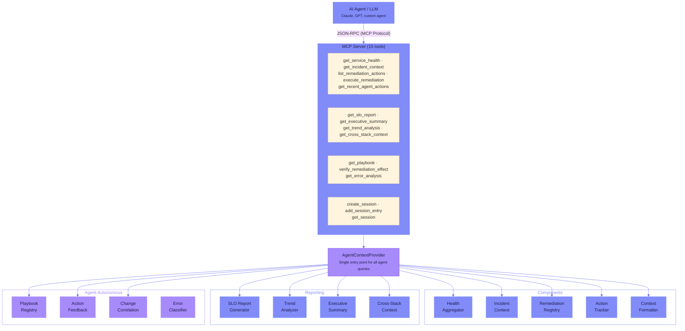

# MCP Server & Agent Tools

The `agenttel-agent` module provides the interface layer between AI agents and your application's telemetry. It packages real-time system state into structured formats that LLMs can consume, and provides tools for agents to query health, diagnose incidents, and execute remediation.

This guide covers how to set up and configure the MCP server, the single entry point for all agent queries, and the context formatters that optimize output for LLM consumption.

> **See also:**
> - [MCP Tools Reference](../reference/mcp-tools.md) -- full parameter and output reference for all 15 built-in tools
> - [Incident Response](incident-response.md) -- the Observe-Diagnose-Act-Verify workflow
> - [Multi-Agent Patterns](multi-agent.md) -- coordinator, parallel, swarm, and hierarchical orchestration

---

## Overview



---

## MCP Server

The MCP (Model Context Protocol) server exposes telemetry as tools that AI agents can invoke over HTTP using the JSON-RPC 2.0 protocol.

### Starting the Server

=== "Java"

    ```java
    McpServer mcp = new AgentTelMcpServerBuilder()
        .port(8081)
        .contextProvider(agentContextProvider)
        .remediationExecutor(remediationExecutor)
        .build();

    mcp.start();
    ```

=== "Python"

    ```python
    from agenttel.agent.mcp_server import McpServer

    server = McpServer(
        engine=engine,
        host="0.0.0.0",
        port=8091
    )
    await server.start()
    ```

### Endpoints

| Endpoint | Method | Description |
|----------|--------|-------------|
| `POST /mcp` | JSON-RPC 2.0 | MCP tool listing and invocation |
| `GET /health` | HTTP | Server health check |

### JSON-RPC Methods

| Method | Description |
|--------|-------------|
| `initialize` | MCP handshake -- returns protocol version and capabilities |
| `tools/list` | List all available tools with their schemas |
| `tools/call` | Invoke a specific tool with arguments |

### Built-in Tools (Summary)

The MCP server ships with 15 built-in tools organized into four categories:

| Category | Tools |
|----------|-------|
| **Core** | `get_service_health`, `get_incident_context`, `list_remediation_actions`, `execute_remediation`, `get_recent_agent_actions` |
| **Reporting** | `get_slo_report`, `get_executive_summary`, `get_trend_analysis`, `get_cross_stack_context` |
| **Agent-Autonomous** | `get_playbook`, `verify_remediation_effect`, `get_error_analysis` |
| **Multi-Agent** | `create_session`, `add_session_entry`, `get_session` |

For complete parameter tables, example outputs, and usage guidance for every tool, see the [MCP Tools Reference](../reference/mcp-tools.md).

### Registering Custom Tools

You can extend the MCP server with domain-specific tools:

=== "Java"

    ```java
    McpServer server = builder.build();

    server.registerTool(
        new McpToolDefinition(
            "search_logs",
            "Search recent application logs for a pattern",
            Map.of("query", new ParameterDefinition("string", "Search query"),
                   "timeframe", new ParameterDefinition("string", "Time range (e.g., '1h', '30m')")),
            List.of("query")
        ),
        args -> logService.search(args.get("query"), args.get("timeframe"))
    );
    ```

=== "Python"

    ```python
    async def search_logs(args: dict) -> str:
        return log_service.search(args["query"], args.get("timeframe", "1h"))

    server.register_tool(
        name="search_logs",
        description="Search recent application logs for a pattern",
        handler=search_logs,
        parameters={
            "query": {"type": "string", "description": "Search query"},
            "timeframe": {"type": "string", "description": "Time range"}
        },
        required=["query"]
    )
    ```

---

## AgentContextProvider

The single entry point for all agent queries. Wires together all components, including the reporting and agent-autonomous layers.

```java
AgentContextProvider provider = new AgentContextProvider(
    healthAggregator,
    incidentContextBuilder,
    remediationRegistry,
    topology,
    patternMatcher,
    rollingBaselines,
    actionTracker
);

// Wire in reporting components
provider.setReportingComponents(
    sloReportGenerator,
    trendAnalyzer,
    executiveSummaryBuilder,
    crossStackContextBuilder
);

// Wire in agent-autonomous components
provider.setAutonomousComponents(
    playbookRegistry,
    remediationExecutor
);

// Core queries
String health = provider.getHealthSummary();
String incident = provider.getIncidentContext("POST /api/payments");
String actions = provider.getAvailableActions("POST /api/payments");
String audit = provider.getRecentActions();

// Reporting queries
String sloReport = provider.getSloReport("text");
String trends = provider.getTrendAnalysis("POST /api/payments", 30);
String executive = provider.getExecutiveSummary();
String crossStack = provider.getCrossStackContext("POST /api/payments");

// Agent-autonomous queries
String playbook = provider.getPlaybook("POST /api/payments", "error_rate_spike");
String errorAnalysis = provider.getErrorAnalysis("POST /api/payments");
String verification = provider.verifyRemediationEffect("toggle-circuit-breaker");

// JSON for structured tool results
String healthJson = provider.getHealthSummaryJson();

// Raw objects for programmatic access
IncidentContext ctx = provider.getIncidentContextObject("POST /api/payments");
```

---

## Context Formatters

`ContextFormatter` produces prompt-optimized output in multiple formats, each designed for a specific context window budget.

### Compact Health (~200 tokens)

Use as a system prompt prefix or quick status check.

```java
String compact = ContextFormatter.formatHealthCompact(healthSummary);
```

### Full Incident (~800 tokens)

Use when an agent needs to diagnose and act on an incident.

```java
String full = ContextFormatter.formatIncidentFull(incidentContext);
```

### Compact Incident (~100 tokens)

Use for notifications or alert summaries.

```java
String brief = ContextFormatter.formatIncidentCompact(incidentContext);
```

### JSON Health

Use for structured tool results that agents can parse.

```java
String json = ContextFormatter.formatHealthAsJson(healthSummary);
```

---

## Integration with Spring Boot

The agent layer is auto-configured when `agenttel-agent` is on the classpath:

```java
@Configuration
public class AgentConfig {

    @Bean
    public ServiceHealthAggregator serviceHealthAggregator(
            RollingBaselineProvider baselines, SloTracker sloTracker) {
        return new ServiceHealthAggregator(baselines, sloTracker);
    }

    @Bean
    public AgentActionTracker agentActionTracker(OpenTelemetry otel) {
        return new AgentActionTracker(otel);
    }

    @Bean
    public RemediationRegistry remediationRegistry() {
        RemediationRegistry registry = new RemediationRegistry();
        // Register your actions...
        return registry;
    }

    @Bean
    public McpServer mcpServer(AgentContextProvider provider,
                                RemediationExecutor executor,
                                ToolPermissionRegistry permissionRegistry,
                                SessionManager sessionManager) throws IOException {
        McpServer server = new AgentTelMcpServerBuilder()
            .port(8081)
            .contextProvider(provider)
            .remediationExecutor(executor)
            .permissionRegistry(permissionRegistry)
            .sessionManager(sessionManager)
            .build();
        server.start();
        return server;
    }
}
```

---

## Integration with FastAPI

```python
from fastapi import FastAPI
from agenttel.fastapi import instrument_fastapi
from agenttel.agent.mcp_server import McpServer

app = FastAPI()
engine = instrument_fastapi(app)

# Start MCP server alongside the app
@app.on_event("startup")
async def start_mcp():
    server = McpServer(engine=engine, port=8091)
    await server.start()
```

---

## Next Steps

- **[MCP Tools Reference](../reference/mcp-tools.md)** -- full details for all 15 built-in tools
- **[Incident Response](incident-response.md)** -- build the Observe-Diagnose-Act-Verify workflow
- **[Multi-Agent Patterns](multi-agent.md)** -- set up coordinator, parallel, and swarm topologies
