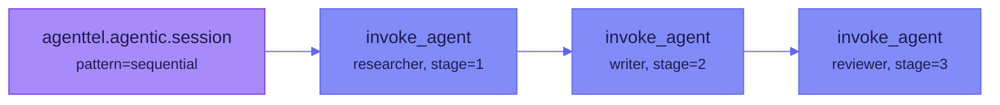
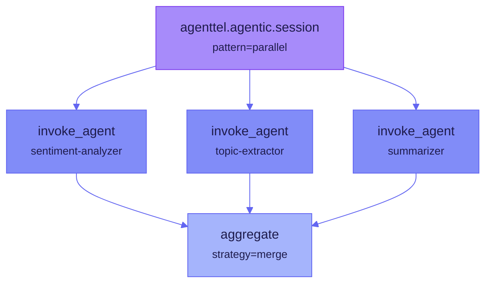
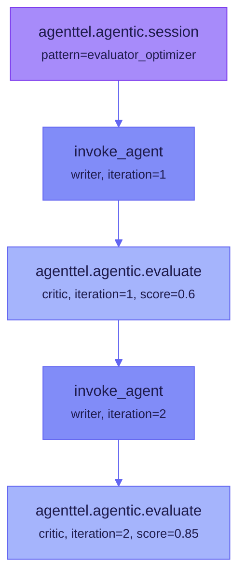

# Orchestration Patterns

AgentTel provides first-class support for multi-agent orchestration patterns identified across Microsoft, Google, and Anthropic agent architectures. Each pattern gets a dedicated class with typed APIs and structured span output.

## Pattern Overview

| Pattern | Class | Description |
|---------|-------|-------------|
| `sequential` | `SequentialOrchestration` | Pipeline — agents execute in order, each stage passes output to the next |
| `parallel` | `ParallelOrchestration` | Fan-out/fan-in — multiple agents execute concurrently, results are aggregated |
| `evaluator_optimizer` | `EvalLoopOrchestration` | Generator-critic loop — iterates until quality threshold is met |
| `handoff` | via `AgentInvocation.handoff()` | Delegation — one agent hands control to another |
| `react` | via `AgentInvocation` | Single-agent thought-action-observation loop |
| `orchestrator_workers` | via `Orchestration` + `TaskScope` | One orchestrator decomposes work and delegates to workers |
| `group_chat` | via `Orchestration` | Multiple agents participate in a shared conversation |
| `swarm` | via `Orchestration` | Decentralized agents coordinate without a central orchestrator |
| `hierarchical` | via `Orchestration` | Multi-level orchestrator tree |

---

## Creating Orchestrations

All orchestrations start from an `AgentTracer`:

```java
AgentTracer tracer = AgentTracer.create(openTelemetry)
    .agentName("coordinator")
    .agentType(AgentType.ORCHESTRATOR)
    .build();

// The pattern determines the return type
Orchestration orch = tracer.orchestrate(OrchestrationPattern.SEQUENTIAL);
```

Every orchestration creates a root span named `agenttel.agentic.session` with `orchestration.pattern` set.

---

## Sequential Pattern

Agents execute in order. Each stage's output feeds into the next.

```java
try (SequentialOrchestration seq = tracer.orchestrate(
        OrchestrationPattern.SEQUENTIAL, 3)) {

    // Stage 1: Research
    try (AgentInvocation stage1 = seq.stage("researcher", 1)) {
        stage1.step(StepType.ACTION, "Searching knowledge base");
        stage1.complete(true);
    }

    // Stage 2: Draft
    try (AgentInvocation stage2 = seq.stage("writer", 2)) {
        stage2.step(StepType.ACTION, "Drafting response");
        stage2.complete(true);
    }

    // Stage 3: Review
    try (AgentInvocation stage3 = seq.stage("reviewer", 3)) {
        stage3.step(StepType.EVALUATION, "Checking accuracy");
        stage3.complete(true);
    }

    seq.complete();
}
```



**Key attributes:**

| Attribute | Value |
|-----------|-------|
| `orchestration.pattern` | `sequential` |
| `orchestration.stage` | Stage number (1-indexed) |
| `orchestration.total_stages` | Total number of stages |

---

## Parallel Pattern

Multiple agents execute concurrently. Results are aggregated with a named strategy.

```java
try (ParallelOrchestration par = (ParallelOrchestration)
        tracer.orchestrate(OrchestrationPattern.PARALLEL)) {

    // Launch branches concurrently
    CompletableFuture<String> f1 = CompletableFuture.supplyAsync(() -> {
        try (AgentInvocation branch = par.branch("sentiment-analyzer")) {
            branch.complete(true);
            return "positive";
        }
    });

    CompletableFuture<String> f2 = CompletableFuture.supplyAsync(() -> {
        try (AgentInvocation branch = par.branch("topic-extractor")) {
            branch.complete(true);
            return "technology";
        }
    });

    CompletableFuture<String> f3 = CompletableFuture.supplyAsync(() -> {
        try (AgentInvocation branch = par.branch("summarizer")) {
            branch.complete(true);
            return "AI advances in 2025";
        }
    });

    // Wait for all branches
    CompletableFuture.allOf(f1, f2, f3).join();

    // Record aggregation strategy
    par.aggregate("merge");
    par.complete();
}
```



!!! info
    `ParallelOrchestration.branch()` is thread-safe. The branch count is tracked with `AtomicLong` and recorded when `aggregate()` is called.

**Key attributes:**

| Attribute | Value |
|-----------|-------|
| `orchestration.pattern` | `parallel` |
| `orchestration.parallel_branches` | Number of branches |
| `orchestration.aggregation` | Aggregation strategy name |

---

## Evaluator-Optimizer Pattern

An iterative generate-evaluate loop where a generator produces output and an evaluator scores it. The loop continues until the quality threshold is met.

```java
try (EvalLoopOrchestration evalLoop = (EvalLoopOrchestration)
        tracer.orchestrate(OrchestrationPattern.EVALUATOR_OPTIMIZER)) {

    double score = 0;
    int iteration = 0;
    String output = "";

    while (score < 0.8 && iteration < 5) {
        iteration++;

        // Generate
        try (AgentInvocation gen = evalLoop.generate("writer", iteration)) {
            output = llm.generate(prompt + (iteration > 1 ? "\nFeedback: " + feedback : ""));
            gen.complete(true);
        }

        // Evaluate
        try (EvalLoopOrchestration.EvalInvocation eval =
                evalLoop.evaluate("critic", iteration)) {
            score = evaluator.score(output);
            eval.score(score);

            if (score < 0.8) {
                eval.feedback("Needs more specific examples");
            }
            eval.complete(score >= 0.8);
        }
    }

    evalLoop.complete();
}
```



**Key attributes on evaluate span:**

| Attribute | Value |
|-----------|-------|
| `agent.type` | `evaluator` |
| `step.iteration` | Iteration number |
| `quality.eval_score` | Score (0.0–1.0) |

---

## Handoff Pattern

One agent delegates to another when a task requires different expertise.

```java
try (AgentInvocation primary = tracer.invoke("Handle customer query")) {
    primary.step(StepType.THOUGHT, "This requires billing expertise");

    // Handoff to specialist
    try (HandoffScope handoff =
            primary.handoff("billing-specialist", "Billing-related query")) {

        try (AgentInvocation specialist =
                tracer.invoke("billing-specialist", "Process refund request")) {
            specialist.complete(true);
        }
    }

    primary.complete(true);
}
```

For multi-hop handoff chains, track the `chain_depth`:

```java
try (HandoffScope h = invocation.handoff("escalation-agent", "Needs manager", 2)) {
    // chain_depth=2 means: original → first-handoff → this agent
}
```

---

## ReAct Pattern

The classic thought-action-observation loop is expressed with a single `AgentInvocation`:

```java
try (AgentInvocation inv = tracer.invoke("Answer user question")) {
    inv.maxSteps(10);

    // Thought
    inv.step(StepType.THOUGHT, "Need to search for recent information");

    // Action
    try (ToolCallScope tool = inv.toolCall("web_search")) {
        var results = search(query);
        tool.success();
    }

    // Observation
    inv.step(StepType.OBSERVATION, "Found 3 relevant articles");

    // Thought
    inv.step(StepType.THOUGHT, "Have enough information to answer");

    inv.complete(true);
}
```

!!! tip
    ReAct doesn't need an orchestration — it's a single-agent pattern. Use `OrchestrationPattern.REACT` only if you want to wrap it in a session span for consistency with other orchestrated workflows.

---

## Orchestrator-Workers Pattern

An orchestrator decomposes a task and delegates sub-tasks to worker agents.

```java
try (Orchestration orch = tracer.orchestrate(OrchestrationPattern.ORCHESTRATOR_WORKERS)) {

    // Orchestrator invocation
    try (AgentInvocation orchestrator = orch.invoke("planner", "Build feature X")) {

        // Decompose into tasks
        try (TaskScope task1 = orchestrator.task("Design API schema")) {
            try (AgentInvocation worker = orch.invoke("api-designer", "Design REST API")) {
                worker.complete(true);
            }
            task1.complete();
        }

        try (TaskScope task2 = orchestrator.task("Implement backend")) {
            try (AgentInvocation worker = orch.invoke("backend-dev", "Implement handlers")) {
                worker.complete(true);
            }
            task2.complete();
        }

        try (TaskScope task3 = orchestrator.task("Write tests")) {
            try (AgentInvocation worker = orch.invoke("test-writer", "Write integration tests")) {
                worker.complete(true);
            }
            task3.complete();
        }

        orchestrator.complete(true);
    }

    orch.complete();
}
```

---

## Choosing a Pattern

| If you need to... | Use |
|-------------------|-----|
| Execute agents in a pipeline, each consuming the previous output | `SEQUENTIAL` |
| Run independent analysis tasks concurrently | `PARALLEL` |
| Iteratively improve output quality | `EVALUATOR_OPTIMIZER` |
| Delegate to a specialist when expertise changes | Handoff via `AgentInvocation.handoff()` |
| Implement a thought-action-observation loop | ReAct via single `AgentInvocation` |
| Decompose work and assign to workers | `ORCHESTRATOR_WORKERS` |
| Enable free-form multi-agent conversation | `GROUP_CHAT` |
| Decentralized autonomous coordination | `SWARM` |
| Multi-level orchestrator hierarchy | `HIERARCHICAL` |

---

## Further Reading

- [Agent Observability](agent-observability.md) — core agent tracing APIs
- [Agent Cost Tracking](agent-cost-tracking.md) — cost aggregation across orchestrations
- [Agentic Attributes Reference](../reference/agent-attributes.md) — all orchestration attributes
