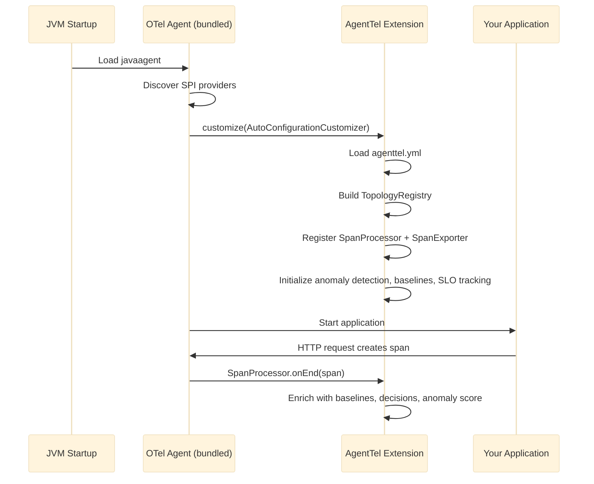

# Zero-Code Mode

A single javaagent JAR for any JVM application. No library dependency, no Spring, no code changes — just a YAML config file and a JVM flag.

---

## When to Use Zero-Code Mode

| Scenario | Use Zero-Code Mode | Use Spring Boot Starter |
|----------|:------------------:|:----------------------:|
| Can't add library dependencies | Yes | - |
| Non-Spring JVM app (Dropwizard, Micronaut, plain Java) | Yes | - |
| Already using OTel javaagent | Yes | Either |
| Spring Boot app with full control | Either | Yes |
| Need `@AgentOperation` annotations | - | Yes |
| Want AOP-based span creation | - | Yes |

Zero-code mode gives you the same span enrichment (topology, baselines, decisions, anomaly detection) as the Spring Boot starter — without touching your application code.

---

## Quick Start

### 1. Get the JAR

The AgentTel javaagent is a single JAR that bundles the OpenTelemetry agent with AgentTel enrichment. No separate OTel download needed.

```bash
# Build from source
./gradlew :agenttel-javaagent:assemble

# Output: agenttel-javaagent/build/libs/agenttel-javaagent-0.1.0-alpha.jar
```

### 2. Create Configuration

Create an `agenttel.yml` file:

```yaml
agenttel:
  topology:
    team: payments-platform
    tier: critical
    domain: commerce
    on-call-channel: "#payments-oncall"
    repo-url: "https://github.com/myorg/payment-service"

  dependencies:
    - name: postgres
      type: database
      criticality: required
      timeout-ms: 5000
      circuit-breaker: true
    - name: stripe-api
      type: external_api
      criticality: required
      fallback: "Return cached pricing"

  consumers:
    - name: order-service
      pattern: sync
      sla-latency-ms: 500

  profiles:
    critical-write:
      retryable: false
      escalation-level: page_oncall
      safe-to-restart: false
    read-only:
      retryable: true
      idempotent: true
      escalation-level: notify_team

  operations:
    "POST /api/payments":
      profile: critical-write
      expected-latency-p50: "45ms"
      expected-latency-p99: "200ms"
      expected-error-rate: 0.001
      retryable: true              # overrides profile default
    "GET /api/payments/{id}":
      profile: read-only
      expected-latency-p50: "15ms"
      expected-latency-p99: "80ms"

  baselines:
    rolling-window-size: 1000
    rolling-min-samples: 10

  anomaly-detection:
    enabled: true
    z-score-threshold: 3.0
```

!!! info "No bracket notation needed"
    Unlike Spring Boot's `application.yml`, the standalone `agenttel.yml` does **not** require bracket notation for operation names with special characters. `"POST /api/payments"` works directly because AgentTel uses Jackson YAML parsing, not Spring's property binder.

### 3. Run Your Application

```bash
java -javaagent:agenttel-javaagent.jar \
     -Dagenttel.config.file=agenttel.yml \
     -jar myapp.jar
```

That's it. The javaagent auto-instruments your application (HTTP servers, database calls, HTTP clients, messaging) and enriches every span with AgentTel attributes.

---

## What's Inside

The `agenttel-javaagent.jar` bundles two things into a single artifact:

| Component | What It Does |
|-----------|-------------|
| **OpenTelemetry Javaagent** | Auto-instruments your app via bytecode manipulation — creates spans for HTTP, JDBC, messaging, etc. |
| **AgentTel Extension** | Enriches those spans with topology, baselines, decisions, anomaly scores via OTel SPI |

You don't need to download or manage the OTel javaagent separately — it's included.

---

## Configuration Sources

The javaagent loads configuration from three sources, in priority order:

| Priority | Source | Example |
|----------|--------|---------|
| **1 (highest)** | System properties | `-Dagenttel.topology.team=payments` |
| **2** | Environment variables | `AGENTTEL_TOPOLOGY_TEAM=payments` |
| **3** | YAML config file | `agenttel.yml` (via `-Dagenttel.config.file` or working directory) |

System properties and environment variables override values from the YAML file. This lets you use a shared config file across environments while overriding specific values per deployment:

```bash
# Same agenttel.yml, different tier per environment
java -javaagent:agenttel-javaagent.jar \
     -Dagenttel.config.file=agenttel.yml \
     -Dagenttel.topology.tier=standard \
     -jar myapp.jar
```

### Environment Variable Naming

Environment variables use uppercase with underscores, prefixed with `AGENTTEL_`:

| YAML Path | System Property | Environment Variable |
|-----------|----------------|---------------------|
| `topology.team` | `agenttel.topology.team` | `AGENTTEL_TOPOLOGY_TEAM` |
| `topology.tier` | `agenttel.topology.tier` | `AGENTTEL_TOPOLOGY_TIER` |
| `topology.domain` | `agenttel.topology.domain` | `AGENTTEL_TOPOLOGY_DOMAIN` |
| `topology.on-call-channel` | `agenttel.topology.on-call-channel` | `AGENTTEL_TOPOLOGY_ON_CALL_CHANNEL` |
| `enabled` | `agenttel.enabled` | `AGENTTEL_ENABLED` |

### Config File Discovery

If `-Dagenttel.config.file` is not set, the javaagent looks for `agenttel.yml` in the working directory. If no config file is found, only system property and environment variable configuration is used.

---

## How It Works

The AgentTel javaagent bundles the OTel agent with an AgentTel extension. At startup, the OTel agent discovers the extension via SPI and initializes it:



The extension registers two components with OTel:

1. **`AgentTelSpanProcessor`** — enriches spans with baselines, decisions, and anomaly scores as they complete
2. **`AgentTelEnrichingSpanExporter`** — adds computed attributes (rolling baselines, SLO budget) at export time

Both run transparently — your application code doesn't know AgentTel exists.

---

## Profile Resolution

Profiles reduce repetition across operations. When an operation references a profile, the profile's defaults are applied first, then operation-specific values override them:

```yaml
profiles:
  critical-write:
    retryable: false
    escalation-level: page_oncall
    safe-to-restart: false

operations:
  "POST /api/payments":
    profile: critical-write
    retryable: true        # overrides profile's false → true
    # escalation-level, safe-to-restart inherited from profile
```

**Merge rules:**

| Field | Rule |
|-------|------|
| `retryable`, `idempotent` | Operation value if set, else profile value |
| `escalation-level` | Operation value unless `auto_resolve` (default), then profile value |
| `runbook-url`, `fallback-description` | Operation value if non-empty, else profile value |
| `safe-to-restart` | `false` wins (if either profile or operation says false) |

---

## What Gets Enriched

Every span that matches a registered operation gets these attributes:

**Resource attributes** (set once per service):

| Attribute | Example |
|-----------|---------|
| `agenttel.topology.team` | `payments-platform` |
| `agenttel.topology.tier` | `critical` |
| `agenttel.topology.domain` | `commerce` |
| `agenttel.topology.on_call_channel` | `#payments-oncall` |
| `agenttel.topology.dependencies` | `[{"name":"postgres",...}]` |

**Span attributes** (per operation):

| Attribute | Example |
|-----------|---------|
| `agenttel.baseline.latency_p50_ms` | `45.0` |
| `agenttel.baseline.latency_p99_ms` | `200.0` |
| `agenttel.baseline.error_rate` | `0.001` |
| `agenttel.baseline.source` | `rolling` or `static` |
| `agenttel.decision.retryable` | `true` |
| `agenttel.decision.escalation_level` | `page_oncall` |
| `agenttel.decision.runbook_url` | `https://wiki/runbooks/...` |
| `agenttel.anomaly.detected` | `true` |
| `agenttel.anomaly.score` | `0.85` |
| `agenttel.slo.budget_remaining` | `0.85` |

See [Attribute Dictionary](../reference/attribute-dictionary.md) for the complete reference.

---

## Comparison with Spring Boot Starter

| Feature | Zero-Code Mode | Spring Boot Starter |
|---------|:--------------:|:-------------------:|
| Span enrichment (baselines, decisions, anomaly) | Yes | Yes |
| Topology on OTel Resource | Yes | Yes |
| Rolling baselines | Yes | Yes |
| Operation profiles | Yes | Yes |
| Config from YAML | Yes | Yes |
| Config from system props / env vars | Yes | Yes |
| `@AgentOperation` annotations | No | Yes |
| AOP span creation | No | Yes |
| `@AgentObservable` class scanning | No | Yes |
| MCP server auto-config | No | Yes |
| GenAI instrumentation auto-config | No | Yes |
| Spring dependency required | No | Yes |

!!! tip "Combining Both"
    If your Spring Boot app already uses the OTel javaagent, you can use the Spring Boot starter *instead* of the javaagent — the starter registers the same components via Spring auto-configuration rather than SPI. Don't use both simultaneously.

---

## Containerized Deployment

### Docker

```dockerfile
FROM eclipse-temurin:17-jre

COPY agenttel-javaagent.jar /opt/agents/
COPY agenttel.yml /opt/config/
COPY myapp.jar /opt/app/

ENTRYPOINT ["java", \
  "-javaagent:/opt/agents/agenttel-javaagent.jar", \
  "-Dagenttel.config.file=/opt/config/agenttel.yml", \
  "-Dotel.exporter.otlp.endpoint=http://collector:4317", \
  "-jar", "/opt/app/myapp.jar"]
```

### Kubernetes

```yaml
env:
  - name: JAVA_TOOL_OPTIONS
    value: >-
      -javaagent:/opt/agents/agenttel-javaagent.jar
      -Dagenttel.config.file=/opt/config/agenttel.yml
  - name: AGENTTEL_TOPOLOGY_TIER
    value: "critical"
  - name: OTEL_EXPORTER_OTLP_ENDPOINT
    value: "http://otel-collector:4317"
```

Use `JAVA_TOOL_OPTIONS` so the agent flags apply without modifying the container entrypoint.

---

## OTel Configuration

Since the OTel agent is bundled inside, you configure it using standard OTel system properties or environment variables:

```bash
java -javaagent:agenttel-javaagent.jar \
     -Dagenttel.config.file=agenttel.yml \
     -Dotel.exporter.otlp.endpoint=http://collector:4317 \
     -Dotel.service.name=payment-service \
     -jar myapp.jar
```

Common OTel properties:

| Property | Environment Variable | Description |
|----------|---------------------|-------------|
| `otel.service.name` | `OTEL_SERVICE_NAME` | Service name for traces |
| `otel.exporter.otlp.endpoint` | `OTEL_EXPORTER_OTLP_ENDPOINT` | Collector endpoint |
| `otel.traces.exporter` | `OTEL_TRACES_EXPORTER` | Exporter type (default: `otlp`) |
| `otel.resource.attributes` | `OTEL_RESOURCE_ATTRIBUTES` | Additional resource attributes |

---

## Building from Source

```bash
# Build the javaagent JAR
./gradlew :agenttel-javaagent:assemble

# Run tests
./gradlew :agenttel-javaagent:test

# Output JAR:
# agenttel-javaagent/build/libs/agenttel-javaagent-0.1.0-alpha.jar
```

The build uses a two-step process:

1. **Shadow JAR** — bundles `agenttel-core`, `agenttel-api`, Jackson YAML, and all transitive dependencies into a self-contained extension
2. **Agent JAR** — extracts the upstream OTel javaagent and embeds the extension into its `extensions/` directory

The result is a single JAR with the OTel agent's `Premain-Class` manifest entry preserved.

---

## Further Reading

- [Architecture](../concepts/architecture.md) — how AgentTel components fit together
- [Configuration Reference](../reference/configuration.md) — all configuration properties
- [Attribute Dictionary](../reference/attribute-dictionary.md) — every attribute AgentTel adds to spans
- [Quick Start](../getting-started/quick-start.md) — all integration paths including Spring Boot and frontend
