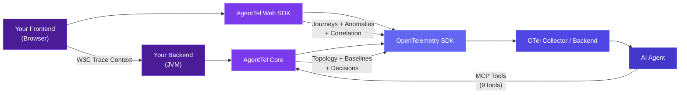
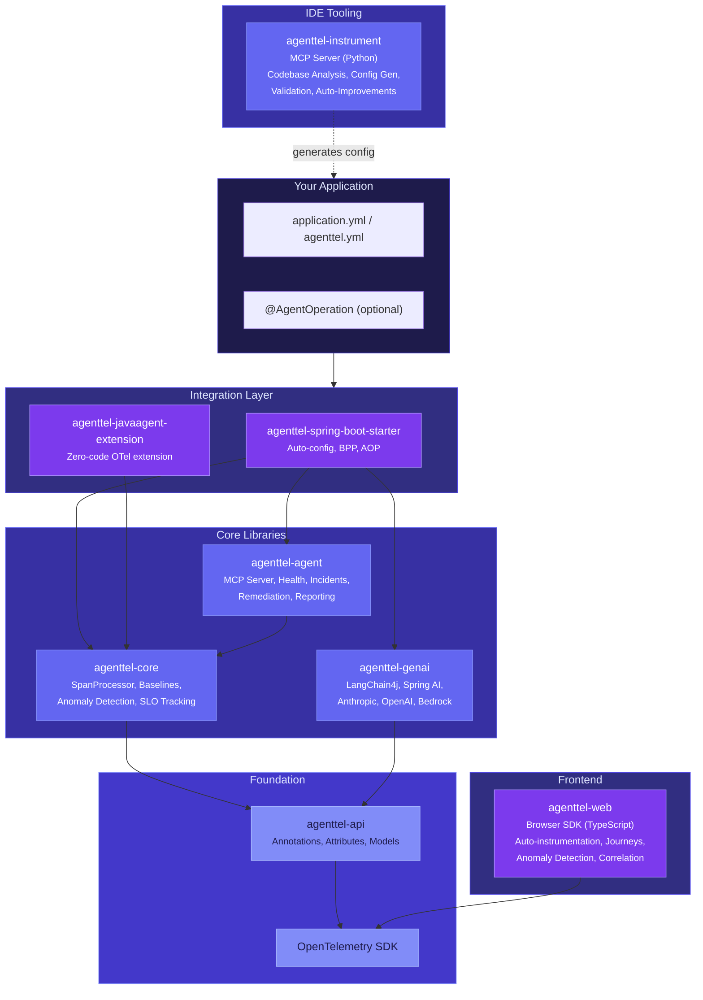

---
hide:
  - navigation
  - toc
---

<div class="hero" markdown>

# AgentTel

<p class="hero-tagline">Agent-Ready Telemetry</p>

<p class="hero-description">
Enrich OpenTelemetry spans — backend and frontend — with the structured context
AI agents need to autonomously diagnose and resolve production incidents.
</p>

[Get Started](getting-started/quick-start.md){ .md-button .md-button--primary }
[Try the Docker Demo](getting-started/quick-start.md#try-the-docker-demo){ .md-button }

</div>

---

## What is AgentTel?

<div class="what-is" markdown>

Standard observability answers *"What happened?"*
AgentTel adds *"What does an AI agent need to know to act on this?"*

Modern observability tools generate massive volumes of telemetry — traces, metrics, logs — optimized for **human consumption** through dashboards and alert rules. AI agents tasked with autonomous incident response face critical gaps:

- **No behavioral context** — Spans lack baselines, so agents can't distinguish normal from anomalous
- **No topology awareness** — Agents don't know which services are critical, who owns them, or what depends on what
- **No decision metadata** — Is this operation retryable? Is there a fallback? What's the runbook?
- **No actionable interface** — Agents can read telemetry but can't query live system state or execute remediation

AgentTel closes these gaps at the instrumentation layer — enriching every span across the full stack (JVM backends and browser frontends) with baselines, topology, and decision metadata so AI agents can reason and act autonomously.

</div>

---

## How It Works

AgentTel enriches telemetry across the full stack — all configurable via YAML or code, no manual instrumentation required:



| Level | Where | What It Adds | Example |
|-------|-------|-------------|---------|
| **Topology** | OTel Resource (once per service) | Service identity, ownership, dependencies | team, tier, on-call channel |
| **Baselines** | Span attributes (per operation) | What "normal" looks like — backend and frontend | P50/P99 latency, error rate, page load time |
| **Decisions** | Span attributes (per operation) | What an agent is allowed to do | retryable, runbook URL, escalation level |
| **Journeys** | Frontend spans (per user flow) | Multi-step funnel tracking | checkout completion rate, step abandonment |
| **Anomalies** | Both backend and frontend spans | Real-time deviation detection | z-score spikes, rage clicks, error loops |
| **Correlation** | Cross-stack span linking | Frontend-to-backend trace linking | W3C Trace Context, backend trace IDs |

---

## Key Features

<div class="feature-grid" markdown>

<div class="feature-card" markdown>

### Enriched Spans

Every operation span carries baselines (P50/P99 latency, error rate), decision metadata (retryable, idempotent, runbook URL), and anomaly scores — all the context an AI agent needs.

</div>

<div class="feature-card" markdown>

### MCP Server

Built-in [Model Context Protocol](https://modelcontextprotocol.io) server exposes tools like `get_service_health`, `get_incident_context`, and `execute_remediation` over JSON-RPC.

</div>

<div class="feature-card" markdown>

### Zero-Code Mode

Drop-in OTel javaagent extension for any JVM app. No Spring dependency, no code changes — just a YAML config file and a JVM flag.

</div>

<div class="feature-card" markdown>

### GenAI Instrumentation

Full observability for LangChain4j, Spring AI, Anthropic SDK, OpenAI SDK, and AWS Bedrock — with token tracking and cost calculation.

</div>

<div class="feature-card" markdown>

### Frontend Telemetry

Browser SDK (`@agenttel/web`) with auto-instrumentation of page loads, navigation, API calls, and errors — plus journey tracking, anomaly detection, and W3C cross-stack correlation.

</div>

<div class="feature-card" markdown>

### Anomaly Detection

Real-time z-score anomaly detection on latency and error rates — backend and frontend. Rolling baselines learn from live traffic; static baselines come from config.

</div>

<div class="feature-card" markdown>

### Incident Context

Structured incident packages: what's happening, what changed, what's affected, and what to do — with cross-stack context linking frontend and backend telemetry.

</div>

<div class="feature-card" markdown>

### Instrumentation Agent

IDE MCP server that analyzes your codebase, generates AgentTel config, validates instrumentation, and auto-applies improvements — for both backend and frontend.

</div>

</div>

---

## Module Architecture



---

## What an Agent Sees

When an incident occurs, an AI agent gets structured context via MCP:

```
=== INCIDENT inc-a3f2b1c4 ===
SEVERITY: HIGH
SUMMARY: POST /api/payments experiencing elevated error rate (5.2%)

## WHAT IS HAPPENING
Error Rate: 5.2% (baseline: 0.1%)
Latency P50: 312ms (baseline: 45ms)
Patterns: ERROR_RATE_SPIKE

## WHAT CHANGED
Last Deploy: v2.1.0 at 2025-01-15T14:30:00Z

## WHAT IS AFFECTED
Scope: operation_specific
User-Facing: YES
Affected Deps: stripe-api

## SUGGESTED ACTIONS
  - [HIGH] rollback_deployment: Rollback to previous version (NEEDS APPROVAL)
  - [MEDIUM] enable_circuit_breakers: Circuit break stripe-api
```

---

## Compatibility

**Backend (JVM)**

| Component | Supported Versions |
|-----------|--------------------|
| Java | 17, 21 |
| OpenTelemetry SDK | 1.59.0+ |
| Spring Boot | 3.4.x |
| Spring AI | 1.0.0+ (optional) |
| LangChain4j | 1.0.0+ (optional) |
| Anthropic Java SDK | 2.0.0+ (optional) |
| OpenAI Java SDK | 4.0.0+ (optional) |
| AWS Bedrock SDK | 2.30.0+ (optional) |

**Frontend (Browser)**

| Component | Supported Versions |
|-----------|--------------------|
| TypeScript | 4.7+ |
| Modern browsers | Chrome, Firefox, Safari, Edge (ES2020+) |

**Tooling**

| Component | Supported Versions |
|-----------|--------------------|
| Python (instrument agent) | 3.11+ |

<div style="text-align: center; margin-top: 3rem;" markdown>

[Get Started](getting-started/quick-start.md){ .md-button .md-button--primary }
[View on GitHub](https://github.com/rrohitramsen/AgentTel){ .md-button }

</div>
