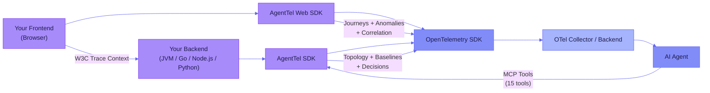
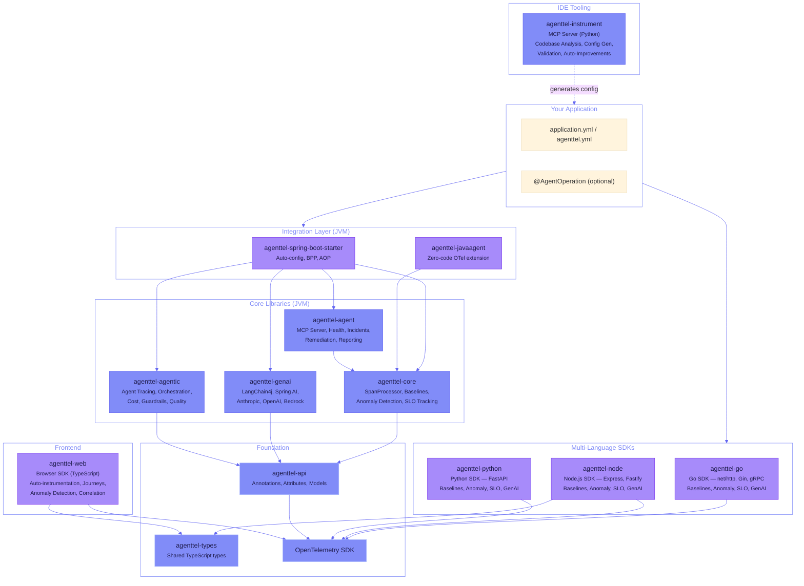

---
hide:
  - navigation
  - toc
---

<div class="hero" markdown>

# AgentTel

<p class="hero-tagline">Agent-Ready Telemetry</p>

<p class="hero-description">
Enrich OpenTelemetry spans — backend and frontend — with the structured context
AI agents need to autonomously diagnose and resolve production incidents.
</p>

[Get Started](getting-started/quick-start.md){ .md-button .md-button--primary }
[Browse the Reference](reference/attribute-dictionary.md){ .md-button }

</div>

---

## What is AgentTel?

<div class="what-is" markdown>

Standard observability answers *"What happened?"*
AgentTel adds *"What does an AI agent need to know to act on this?"*

Modern observability tools generate massive volumes of telemetry — traces, metrics, logs — optimized for **human consumption** through dashboards and alert rules. AI agents tasked with autonomous incident response face critical gaps:

- **No behavioral context** — Spans lack baselines, so agents can't distinguish normal from anomalous
- **No topology awareness** — Agents don't know which services are critical, who owns them, or what depends on what
- **No decision metadata** — Is this operation retryable? Is there a fallback? What's the runbook?
- **No actionable interface** — Agents can read telemetry but can't query live system state or execute remediation

AgentTel closes these gaps at the instrumentation layer — enriching every span across the full stack (JVM, Go, Node.js, Python backends and browser frontends) with baselines, topology, and decision metadata so AI agents can reason and act autonomously.

</div>

**What changes on a span:**

| | Standard OTel Span | With AgentTel | Why It Matters |
|---|---|---|---|
| **Identity** | `http.method=POST`, `http.route=/api/payments` | + `topology.team=payments-platform`, `tier=critical` | Agent knows who owns this, how critical it is, and who to page |
| **Baselines** | *(none)* | + `baseline.latency_p50_ms=45`, `baseline.error_rate=0.001` | Agent can tell if current behavior is normal or anomalous |
| **Decisions** | *(none)* | + `decision.retryable=true`, `decision.runbook_url=...` | Agent knows what it's allowed to do without asking a human |
| **Anomaly** | *(none)* | + `anomaly.detected=true`, `anomaly.score=0.92` | Agent gets alerted in real time, not after a threshold breach |
| **Causality** | *(none)* | + `cause.category=dependency`, `cause.hint=stripe-api timeout` | Agent skips root-cause investigation and jumps to remediation |

---

## How It Works

AgentTel enriches telemetry across the full stack — all configurable via YAML or code, no manual instrumentation required:


```mermaid
%%{init: {'theme': 'base', 'themeVariables': {'lineColor': '#6366f1'}}}%%
graph LR
    B1["Your Backend<br/>(JVM / Go / Node.js / Python)"] --> AT1["AgentTel SDK"]
    B2["Your Frontend<br/>(Browser)"] --> AT2["AgentTel Web SDK"]
    AT1 --> C["OpenTelemetry SDK"]
    AT2 --> C
    C --> D["OTel Collector / Backend"]
    D --> E["AI Agent"]

    AT1 -->|"Topology + Baselines<br/>+ Decisions"| C
    AT2 -->|"Journeys + Anomalies<br/>+ Correlation"| C
    E -->|"MCP Tools<br/>(15 tools)"| AT1
    B2 -->|"W3C Trace Context"| B1

    style B1 fill:#a78bfa,stroke:#7c3aed,color:#1e1b4b
    style B2 fill:#a78bfa,stroke:#7c3aed,color:#1e1b4b
    style AT1 fill:#a78bfa,stroke:#7c3aed,color:#1e1b4b
    style AT2 fill:#a78bfa,stroke:#7c3aed,color:#1e1b4b
    style C fill:#818cf8,stroke:#6366f1,color:#1e1b4b
    style D fill:#a5b4fc,stroke:#6366f1,color:#1e1b4b
    style E fill:#818cf8,stroke:#6366f1,color:#1e1b4b
```

| Level | Where | What It Adds | Example |
|-------|-------|-------------|---------|
| **Topology** | OTel Resource (once per service) | Service identity, ownership, dependencies | team, tier, on-call channel |
| **Baselines** | Span attributes (per operation) | What "normal" looks like — backend and frontend | P50/P99 latency, error rate, page load time |
| **Decisions** | Span attributes (per operation) | What an agent is allowed to do | retryable, runbook URL, escalation level |
| **Journeys** | Frontend spans (per user flow) | Multi-step funnel tracking | checkout completion rate, step abandonment |
| **Anomalies** | Both backend and frontend spans | Real-time deviation detection | z-score spikes, rage clicks, error loops |
| **Correlation** | Cross-stack span linking | Frontend-to-backend trace linking | W3C Trace Context, backend trace IDs |

---

## Key Features

<div class="feature-grid" markdown>

<div class="feature-card" markdown>

### [Multi-Language SDKs](getting-started/quick-start/)

Native SDKs for JVM (Spring Boot), Go (net/http, Gin, gRPC), Node.js (Express, Fastify), and Python (FastAPI) — same YAML config, same enriched attributes, same agent interface across all languages.

</div>

<div class="feature-card" markdown>

### [Enriched Spans](concepts/semantic-conventions/)

Every operation span carries baselines (P50/P99 latency, error rate), decision metadata (retryable, idempotent, runbook URL), and anomaly scores — all the context an AI agent needs.

</div>

<div class="feature-card" markdown>

### [MCP Server](guides/mcp-server/)

Built-in Model Context Protocol server exposes tools like `get_service_health`, `get_incident_context`, and `execute_remediation` over JSON-RPC.

</div>

<div class="feature-card" markdown>

### [Zero-Code Mode](guides/zero-code-mode/)

Drop-in OTel javaagent extension for any JVM app. No Spring dependency, no code changes — just a YAML config file and a JVM flag.

</div>

<div class="feature-card" markdown>

### [GenAI Instrumentation](guides/genai-instrumentation/)

Full observability for LangChain4j, Spring AI, Anthropic SDK, OpenAI SDK, and AWS Bedrock — with token tracking and cost calculation.

</div>

<div class="feature-card" markdown>

### [Frontend Telemetry](guides/frontend-telemetry/)

Browser SDK with auto-instrumentation of page loads, navigation, API calls, and errors — plus journey tracking, anomaly detection, and W3C cross-stack correlation.

</div>

<div class="feature-card" markdown>

### [Anomaly Detection](guides/anomaly-detection/)

Real-time z-score anomaly detection on latency and error rates — backend and frontend. Rolling baselines learn from live traffic; static baselines come from config.

</div>

<div class="feature-card" markdown>

### [Incident Context](guides/incident-response/)

Structured incident packages: what's happening, what changed, what's affected, and what to do — with cross-stack context linking frontend and backend telemetry.

</div>

<div class="feature-card" markdown>

### [Agent Observability](guides/agent-observability/)

Full lifecycle tracing for AI agents — invocations, reasoning steps, tool calls, task decomposition, orchestration patterns, cost aggregation, guardrails, human checkpoints, and quality signals with 70+ semantic attributes.

</div>

<div class="feature-card" markdown>

### [Multi-Agent Support](guides/multi-agent/)

Role-based tool permissions, shared incident sessions (blackboard pattern), and agent identity tracking — enabling coordinator, parallel, swarm, and hierarchical agent patterns.

</div>

<div class="feature-card" markdown>

### [Instrumentation Agent](guides/instrumentation-agent/)

IDE MCP server that analyzes your codebase, generates AgentTel config, validates instrumentation, and auto-applies improvements — for both backend and frontend.

</div>

</div>

---

## Module Architecture


```mermaid
%%{init: {'theme': 'base', 'themeVariables': {'lineColor': '#6366f1'}}}%%
graph TB
    subgraph App["Your Application"]
        YML["application.yml / agenttel.yml"]
        ANN["@AgentOperation (optional)"]
    end

    subgraph Frontend["Frontend"]
        WEB["agenttel-web<br/><small>Browser SDK (TypeScript)<br/>Auto-instrumentation, Journeys,<br/>Anomaly Detection, Correlation</small>"]
    end

    subgraph Integration["Integration Layer (JVM)"]
        SBS["agenttel-spring-boot-starter<br/><small>Auto-config, BPP, AOP</small>"]
        JAE["agenttel-javaagent<br/><small>Zero-code OTel extension</small>"]
    end

    subgraph MultiLang["Multi-Language SDKs"]
        GOSDK["agenttel-go<br/><small>Go SDK — net/http, Gin, gRPC<br/>Baselines, Anomaly, SLO, GenAI</small>"]
        NODESDK["agenttel-node<br/><small>Node.js SDK — Express, Fastify<br/>Baselines, Anomaly, SLO, GenAI</small>"]
        PYSDK["agenttel-python<br/><small>Python SDK — FastAPI<br/>Baselines, Anomaly, SLO, GenAI</small>"]
    end

    subgraph Core["Core Libraries (JVM)"]
        COR["agenttel-core<br/><small>SpanProcessor, Baselines,<br/>Anomaly Detection, SLO Tracking</small>"]
        GEN["agenttel-genai<br/><small>LangChain4j, Spring AI,<br/>Anthropic, OpenAI, Bedrock</small>"]
        AGC["agenttel-agentic<br/><small>Agent Tracing, Orchestration,<br/>Cost, Guardrails, Quality</small>"]
        AGT["agenttel-agent<br/><small>MCP Server, Health, Incidents,<br/>Remediation, Reporting</small>"]
    end

    subgraph Tooling["IDE Tooling"]
        INS["agenttel-instrument<br/><small>MCP Server (Python)<br/>Codebase Analysis, Config Gen,<br/>Validation, Auto-Improvements</small>"]
    end

    subgraph Foundation["Foundation"]
        API["agenttel-api<br/><small>Annotations, Attributes, Models</small>"]
        TYPES["agenttel-types<br/><small>Shared TypeScript types</small>"]
        OTEL["OpenTelemetry SDK"]
    end

    App --> Integration
    App --> MultiLang
    SBS --> COR
    SBS --> GEN
    SBS --> AGC
    SBS --> AGT
    JAE --> COR
    COR --> API
    GEN --> API
    AGC --> API
    AGT --> COR
    GOSDK --> OTEL
    NODESDK --> TYPES
    NODESDK --> OTEL
    PYSDK --> OTEL
    API --> OTEL
    WEB --> TYPES
    WEB --> OTEL
    INS -.->|"generates config"| App

    style App fill:none,stroke:#818cf8,color:#818cf8
    style Frontend fill:none,stroke:#818cf8,color:#818cf8
    style Integration fill:none,stroke:#818cf8,color:#818cf8
    style MultiLang fill:none,stroke:#818cf8,color:#818cf8
    style Core fill:none,stroke:#818cf8,color:#818cf8
    style Tooling fill:none,stroke:#818cf8,color:#818cf8
    style Foundation fill:none,stroke:#818cf8,color:#818cf8
    style SBS fill:#a78bfa,stroke:#7c3aed,color:#1e1b4b
    style JAE fill:#a78bfa,stroke:#7c3aed,color:#1e1b4b
    style WEB fill:#a78bfa,stroke:#7c3aed,color:#1e1b4b
    style GOSDK fill:#a78bfa,stroke:#7c3aed,color:#1e1b4b
    style NODESDK fill:#a78bfa,stroke:#7c3aed,color:#1e1b4b
    style PYSDK fill:#a78bfa,stroke:#7c3aed,color:#1e1b4b
    style INS fill:#818cf8,stroke:#6366f1,color:#1e1b4b
    style COR fill:#818cf8,stroke:#6366f1,color:#1e1b4b
    style GEN fill:#818cf8,stroke:#6366f1,color:#1e1b4b
    style AGC fill:#818cf8,stroke:#6366f1,color:#1e1b4b
    style AGT fill:#818cf8,stroke:#6366f1,color:#1e1b4b
    style API fill:#818cf8,stroke:#a5b4fc,color:#1e1b4b
    style TYPES fill:#818cf8,stroke:#a5b4fc,color:#1e1b4b
    style OTEL fill:#818cf8,stroke:#a5b4fc,color:#1e1b4b
```

---

## What an Agent Sees

When an incident occurs, an AI agent gets structured context via MCP:

```
=== INCIDENT inc-a3f2b1c4 ===
SEVERITY: HIGH
SUMMARY: POST /api/payments experiencing elevated error rate (5.2%)

## WHAT IS HAPPENING
Error Rate: 5.2% (baseline: 0.1%)
Latency P50: 312ms (baseline: 45ms)
Patterns: ERROR_RATE_SPIKE
Error Breakdown: dependency_timeout=62%, connection_error=31%, unknown=7%
Baseline Confidence: high (1,250 samples)

## WHAT CHANGED
Last Deploy: v2.1.0 at 2025-01-15T14:30:00Z
CHANGE CORRELATION:
  Likely cause: DEPLOYMENT (deploy-v2.1.0) — confidence: 0.85

## WHAT IS AFFECTED
Scope: operation_specific
User-Facing: YES
Affected Deps: stripe-api

## SUGGESTED ACTIONS
  - [HIGH] rollback_deployment: Rollback to previous version (NEEDS APPROVAL)
  - [MEDIUM] toggle_circuit_breaker: Circuit break stripe-api
    Spec: failureThreshold=5, halfOpenAfterMs=30000, successThreshold=3

## PLAYBOOK: error-rate-spike-response
  [1] CHECK: Classify error types → step 2
  [2] DECISION: Mostly dependency errors? → step 3 (yes) / step 4 (no)
  [3] ACTION: Enable circuit breaker → step 5
  [4] ACTION: Rollback deployment (NEEDS APPROVAL) → step 5
  [5] CHECK: Verify error rate decreasing
```

---

## Compatibility

**Backend (JVM)**

| Component | Supported Versions |
|-----------|--------------------|
| Java | 17, 21 |
| OpenTelemetry SDK | 1.59.0+ |
| Spring Boot | 3.4.x |
| Spring AI | 1.0.0+ (optional) |
| LangChain4j | 1.0.0+ (optional) |
| Anthropic Java SDK | 2.0.0+ (optional) |
| OpenAI Java SDK | 4.0.0+ (optional) |
| AWS Bedrock SDK | 2.30.0+ (optional) |

**Backend (Go)**

| Component | Supported Versions |
|-----------|--------------------|
| Go | 1.22+ |
| OpenTelemetry SDK | 1.33.0+ |
| net/http, Gin, gRPC | Latest |

**Backend (Node.js)**

| Component | Supported Versions |
|-----------|--------------------|
| Node.js | 18+ |
| TypeScript | 5.0+ |
| OpenTelemetry SDK | 1.30.0+ |
| Express, Fastify | Latest |

**Backend (Python)**

| Component | Supported Versions |
|-----------|--------------------|
| Python | 3.11+ |
| FastAPI | 0.100+ |
| OpenTelemetry SDK | 1.20.0+ |
| Django, Flask | Coming soon |

**Frontend (Browser)**

| Component | Supported Versions |
|-----------|--------------------|
| TypeScript | 4.7+ |
| Modern browsers | Chrome, Firefox, Safari, Edge (ES2020+) |

**Tooling**

| Component | Supported Versions |
|-----------|--------------------|
| Python (instrument agent) | 3.11+ |

<div style="text-align: center; margin-top: 3rem;" markdown>

[Get Started](getting-started/quick-start.md){ .md-button .md-button--primary }
[View on GitHub](https://github.com/rrohitramsen/AgentTel){ .md-button }

</div>
