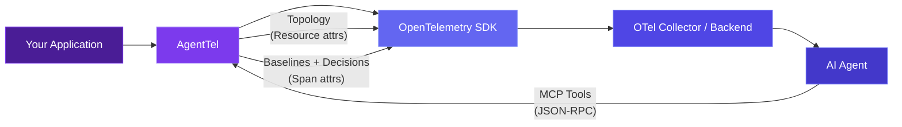
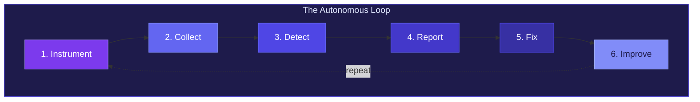
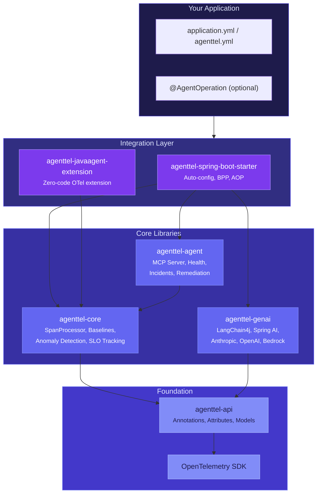

---
hide:
  - navigation
  - toc
---

<div class="hero" markdown>

# AgentTel

<p class="hero-tagline">Agent-Ready Telemetry</p>

<p class="hero-description">
Every span enriched with baselines, topology, and decision metadata —
so AI agents can detect, diagnose, and resolve production incidents autonomously.
From the user's browser to the deepest microservice.
</p>

[Get Started](getting-started/quick-start.md){ .md-button .md-button--primary }
[Try the Docker Demo](getting-started/quick-start.md#try-the-docker-demo){ .md-button }

</div>

---

## Our Goal

Observability generates massive telemetry — traces, metrics, logs — but it's all optimized for **humans staring at dashboards**. AI agents tasked with autonomous incident response hit critical gaps:

- **No baselines** — Agents can't tell "slow" from "normal" without knowing what normal looks like
- **No topology** — Who owns this service? What depends on it? Who gets paged?
- **No decision metadata** — Is this retryable? Is there a fallback? Where's the runbook?
- **No actionable interface** — Agents can read telemetry but can't query live state or act

**AgentTel closes these gaps at the instrumentation layer** — enriching every span so AI agents can reason and act autonomously, and exposing live system state through MCP tools that any agent can call.

---

## What is AgentTel?

AgentTel is an **open-source telemetry framework** that makes your application's observability data ready for AI agents. It sits on top of OpenTelemetry and adds three things:


```mermaid
graph LR
    A["Your Application"] --> B["AgentTel"]
    B --> C["OpenTelemetry SDK"]
    C --> D["OTel Collector / Backend"]
    D --> E["AI Agent"]

    B -->|"Topology<br/>(Resource attrs)"| C
    B -->|"Baselines + Decisions<br/>(Span attrs)"| C
    E -->|"MCP Tools<br/>(JSON-RPC)"| B

    style A fill:#4a1d96,stroke:#7c3aed,color:#fff
    style B fill:#7c3aed,stroke:#a78bfa,color:#fff
    style C fill:#6366f1,stroke:#818cf8,color:#fff
    style D fill:#4f46e5,stroke:#6366f1,color:#fff
    style E fill:#4338ca,stroke:#6366f1,color:#fff
```

| Layer | Where | What It Adds | Example |
|-------|-------|-------------|---------|
| **Topology** | OTel Resource (once per service) | Service identity, ownership, dependencies | team, tier, on-call channel |
| **Baselines** | Span attributes (per operation) | What "normal" looks like | P50/P99 latency, error rate thresholds |
| **Decisions** | Span attributes (per operation) | What an agent is allowed to do | retryable, runbook URL, escalation level |

All configurable via YAML — no code changes required.

---

## How It Works

AgentTel operates as an **autonomous loop** — six phases that continuously improve your system's observability and reliability:


```mermaid
graph TB
    subgraph Loop["The Autonomous Loop"]
        direction LR
        I["1. Instrument"] --> C["2. Collect"]
        C --> D["3. Detect"]
        D --> R["4. Report"]
        R --> F["5. Fix"]
        F --> IM["6. Improve"]
        IM -.->|"repeat"| I
    end

    style Loop fill:#1e1b4b,stroke:#4338ca,color:#e0e7ff
    style I fill:#7c3aed,stroke:#a78bfa,color:#fff
    style C fill:#6366f1,stroke:#818cf8,color:#fff
    style D fill:#4f46e5,stroke:#6366f1,color:#fff
    style R fill:#4338ca,stroke:#6366f1,color:#fff
    style F fill:#3730a3,stroke:#4f46e5,color:#fff
    style IM fill:#818cf8,stroke:#a5b4fc,color:#1e1b4b
```

| Phase | What Happens | Powered By |
|-------|-------------|------------|
| **Instrument** | AI analyzes your codebase and generates telemetry config | agenttel-instrument (MCP server) |
| **Collect** | Enriched spans flow from browser and backend to OTel Collector | agenttel-web + agenttel SDK |
| **Detect** | Anomaly detection flags deviations from baselines in real-time | agenttel-core (z-score engine) |
| **Report** | Structured incident packages optimized for LLM context windows | agenttel-agent (9 MCP tools) |
| **Fix** | AI agent reasons about the incident and executes remediation | agenttel-monitor (autonomous SRE) |
| **Improve** | Feedback engine finds coverage gaps and suggests improvements | agenttel-dashboard + feedback engine |

---

## Key Features

<div class="feature-grid" markdown>

<div class="feature-card" markdown>

### Enriched Spans

Every operation span carries baselines (P50/P99 latency, error rate), decision metadata (retryable, idempotent, runbook URL), and anomaly scores — all the context an AI agent needs.

</div>

<div class="feature-card" markdown>

### MCP Server (9 Tools)

Built-in [Model Context Protocol](https://modelcontextprotocol.io) server exposes tools like `get_service_health`, `get_incident_context`, and `execute_remediation` over JSON-RPC.

</div>

<div class="feature-card" markdown>

### Full-Stack Telemetry

Browser-to-backend: the Web SDK captures user interactions, page loads, and Web Vitals with the same baselines and anomaly detection as the backend.

</div>

<div class="feature-card" markdown>

### Zero-Code Mode

Drop-in OTel javaagent extension for any JVM app. No Spring dependency, no code changes — just a YAML config file and a JVM flag.

</div>

<div class="feature-card" markdown>

### GenAI Instrumentation

Full observability for LangChain4j, Spring AI, Anthropic SDK, OpenAI SDK, and AWS Bedrock — with token tracking and cost calculation.

</div>

<div class="feature-card" markdown>

### Anomaly Detection

Real-time z-score anomaly detection on latency and error rates. Rolling baselines learn from live traffic; static baselines come from config.

</div>

</div>

---

## The Agents

AgentTel comes with built-in agents that demonstrate the autonomous loop — and the same MCP interface lets you build your own.

<div class="vision-grid" markdown>

<div class="vision-card" markdown>

<div class="vision-icon">🛠️</div>

#### Instrumentation Agent

Analyzes your codebase, generates AgentTel config, validates coverage, and suggests improvements. Available as an MCP server that IDE agents (Claude Code, Cursor) can call.

<span class="vision-status available">5 MCP Tools</span>

</div>

<div class="vision-card" markdown>

<div class="vision-icon">🔍</div>

#### Monitor Agent

Autonomous SRE agent that consumes full-stack telemetry — detects anomalies, correlates frontend-to-backend, reasons about root cause, and executes remediation actions.

<span class="vision-status available">Autonomous Loop</span>

</div>

<div class="vision-card" markdown>

<div class="vision-icon">📊</div>

#### Command Center

Real-time command center that queries both MCP servers — fleet health, SLO compliance, trend analysis, traffic generation, coverage gaps, and improvement suggestions with one-click apply.

<span class="vision-status available">10 Panels</span>

</div>

</div>

---

## Build Your Own Agents

This is the real power of AgentTel: **every piece of telemetry is exposed through MCP tools** — a standard JSON-RPC interface that any AI agent can call. You're not locked into our agents. Build your own.

```
# Any MCP-compatible agent can call these tools:

→ get_service_health          # Is the service healthy? What's anomalous?
→ get_incident_context        # Full incident package for LLM reasoning
→ get_slo_report              # SLO budget, burn rate, compliance
→ get_trend_analysis          # Latency/error trends over time
→ get_executive_summary       # ~300 token overview for LLM context
→ get_cross_stack_context     # Browser → Backend correlation
→ get_recent_agent_actions    # Audit trail of agent decisions
→ execute_remediation         # Take action (with approval controls)
→ acknowledge_incident        # Mark incidents as handled
```

**Example: Build a Slack bot that reports SLO status every morning**

```python
import httpx

async def daily_slo_report():
    # Call AgentTel's MCP server — same interface the Monitor agent uses
    response = await httpx.post("http://localhost:8081/mcp", json={
        "jsonrpc": "2.0",
        "method": "tools/call",
        "params": {
            "name": "get_slo_report",
            "arguments": {"format": "text"}
        },
        "id": 1
    })
    slo_data = response.json()["result"]["content"][0]["text"]

    # Feed it to any LLM to generate a human-friendly summary
    summary = await llm.generate(f"Summarize this SLO report for a Slack message:\n{slo_data}")

    await slack.post_message("#sre-channel", summary)
```

**Example: Build a CI/CD gate that checks service health before deploy**

```python
async def pre_deploy_check(service: str):
    response = await httpx.post("http://localhost:8081/mcp", json={
        "jsonrpc": "2.0",
        "method": "tools/call",
        "params": {
            "name": "get_service_health",
            "arguments": {}
        },
        "id": 1
    })
    health = response.json()["result"]["content"][0]["text"]

    if "DEGRADED" in health or "CRITICAL" in health:
        raise Exception(f"Service unhealthy — blocking deploy:\n{health}")
```

The MCP interface is the same one used by Claude, Cursor, and any MCP-compatible tool. Your agents get the same rich, baseline-enriched telemetry that powers the built-in Monitor agent.

[Read the Full-Stack Vision →](project/full-stack-vision.md){ .md-button }

---

## Module Architecture


```mermaid
graph TB
    subgraph App["Your Application"]
        YML["application.yml / agenttel.yml"]
        ANN["@AgentOperation (optional)"]
    end

    subgraph Integration["Integration Layer"]
        SBS["agenttel-spring-boot-starter<br/><small>Auto-config, BPP, AOP</small>"]
        JAE["agenttel-javaagent-extension<br/><small>Zero-code OTel extension</small>"]
    end

    subgraph Core["Core Libraries"]
        COR["agenttel-core<br/><small>SpanProcessor, Baselines,<br/>Anomaly Detection, SLO Tracking</small>"]
        GEN["agenttel-genai<br/><small>LangChain4j, Spring AI,<br/>Anthropic, OpenAI, Bedrock</small>"]
        AGT["agenttel-agent<br/><small>MCP Server, Health,<br/>Incidents, Remediation</small>"]
    end

    subgraph Foundation["Foundation"]
        API["agenttel-api<br/><small>Annotations, Attributes, Models</small>"]
        OTEL["OpenTelemetry SDK"]
    end

    App --> Integration
    SBS --> COR
    SBS --> GEN
    SBS --> AGT
    JAE --> COR
    COR --> API
    GEN --> API
    AGT --> COR
    API --> OTEL

    style App fill:#1e1b4b,stroke:#4338ca,color:#e0e7ff
    style Integration fill:#312e81,stroke:#4f46e5,color:#e0e7ff
    style Core fill:#3730a3,stroke:#6366f1,color:#e0e7ff
    style Foundation fill:#4338ca,stroke:#818cf8,color:#e0e7ff
    style SBS fill:#7c3aed,stroke:#a78bfa,color:#fff
    style JAE fill:#7c3aed,stroke:#a78bfa,color:#fff
    style COR fill:#6366f1,stroke:#818cf8,color:#fff
    style GEN fill:#6366f1,stroke:#818cf8,color:#fff
    style AGT fill:#6366f1,stroke:#818cf8,color:#fff
    style API fill:#818cf8,stroke:#a5b4fc,color:#1e1b4b
    style OTEL fill:#818cf8,stroke:#a5b4fc,color:#1e1b4b
```

---

## What an Agent Sees

When an incident occurs, an AI agent gets structured context via MCP:

```
=== INCIDENT inc-a3f2b1c4 ===
SEVERITY: HIGH
SUMMARY: POST /api/payments experiencing elevated error rate (5.2%)

## WHAT IS HAPPENING
Error Rate: 5.2% (baseline: 0.1%)
Latency P50: 312ms (baseline: 45ms)
Patterns: ERROR_RATE_SPIKE

## WHAT CHANGED
Last Deploy: v2.1.0 at 2025-01-15T14:30:00Z

## WHAT IS AFFECTED
Scope: operation_specific
User-Facing: YES
Affected Deps: stripe-api

## SUGGESTED ACTIONS
  - [HIGH] rollback_deployment: Rollback to previous version (NEEDS APPROVAL)
  - [MEDIUM] enable_circuit_breakers: Circuit break stripe-api
```

---

## Compatibility

| Component | Supported Versions |
|-----------|--------------------|
| Java | 17, 21 |
| OpenTelemetry SDK | 1.59.0+ |
| Spring Boot | 3.4.x |
| Spring AI | 1.0.0+ (optional) |
| LangChain4j | 1.0.0+ (optional) |
| Anthropic Java SDK | 2.0.0+ (optional) |
| OpenAI Java SDK | 4.0.0+ (optional) |
| AWS Bedrock SDK | 2.30.0+ (optional) |

<div style="text-align: center; margin-top: 3rem;" markdown>

[Get Started](getting-started/quick-start.md){ .md-button .md-button--primary }
[View on GitHub](https://github.com/rrohitramsen/AgentTel){ .md-button }

</div>
